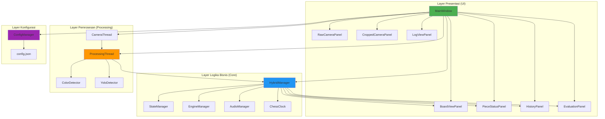
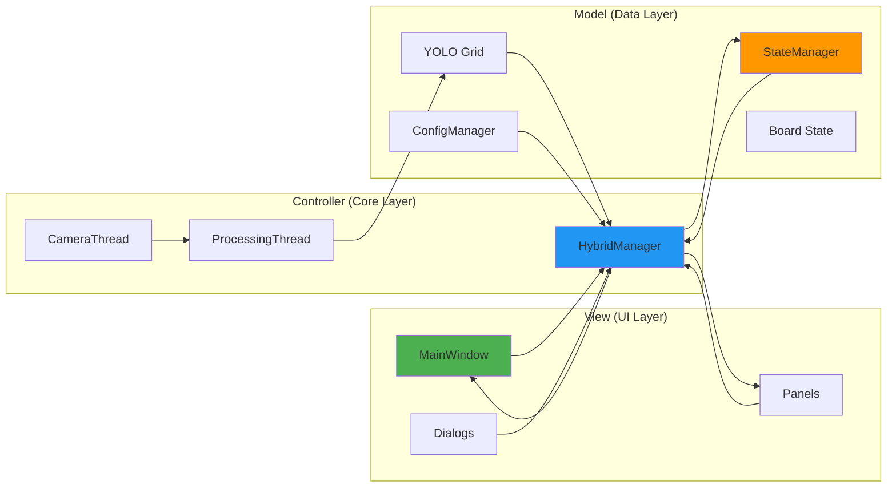
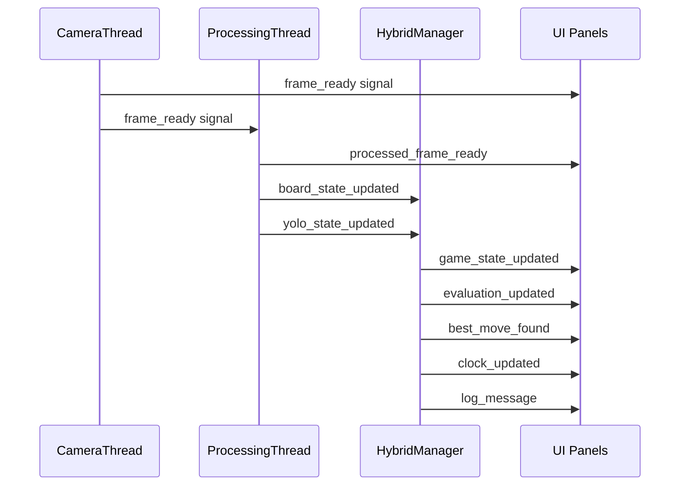

# Diagram Arsitektur Sistem ChessMind Hybrid

## 1. Arsitektur Layer Sistem

```mermaid
graph TB
    subgraph "Layer Presentasi (UI)"
        A[MainWindow]
        B[RawCameraPanel]
        C[CroppedCameraPanel]
        D[BoardViewPanel]
        E[PieceStatusPanel]
        F[HistoryPanel]
        G[EvaluationPanel]
        H[LogViewPanel]
    end
    
    subgraph "Layer Logika Bisnis (Core)"
        I[HybridManager]
        J[StateManager]
        K[EngineManager]
        L[AudioManager]
        M[ChessClock]
    end
    
    subgraph "Layer Pemrosesan (Processing)"
        N[CameraThread]
        O[ProcessingThread]
        P[ColorDetector]
        Q[YoloDetector]
    end
    
    subgraph "Layer Konfigurasi"
        R[ConfigManager]
        S[config.json]
    end
    
    A --> B
    A --> C
    A --> D
    A --> E
    A --> F
    A --> G
    A --> H
    
    A --> N
    A --> O
    A --> I
    
    I --> J
    I --> K
    I --> L
    I --> M
    
    O --> P
    O --> Q
    
    N --> O
    O --> I
    I --> D
    I --> E
    I --> F
    I --> G
    
    R --> S
    A --> R
    
    style A fill:#4CAF50
    style I fill:#2196F3
    style O fill:#FF9800
    style R fill:#9C27B0
```

## 2. Arsitektur MVC (Model-View-Controller)

```mermaid
graph LR
    subgraph "View (UI Layer)"
        V1[MainWindow]
        V2[Panels]
        V3[Dialogs]
    end
    
    subgraph "Controller (Core Layer)"
        C1[HybridManager]
        C2[ProcessingThread]
        C3[CameraThread]
    end
    
    subgraph "Model (Data Layer)"
        M1[StateManager]
        M2[ConfigManager]
        M3[Board State]
        M4[YOLO Grid]
    end
    
    V1 --> C1
    V2 --> C1
    V3 --> C1
    
    C1 --> M1
    C2 --> M4
    C3 --> C2
    
    M1 --> C1
    M4 --> C1
    M2 --> C1
    
    C1 --> V1
    C1 --> V2
    
    style V1 fill:#4CAF50
    style C1 fill:#2196F3
    style M1 fill:#FF9800
```

## 3. Arsitektur Signal-Slot (Event-Driven)

```mermaid
sequenceDiagram
    participant CT as CameraThread
    participant PT as ProcessingThread
    participant HM as HybridManager
    participant UI as UI Panels
    
    CT->>UI: frame_ready signal
    CT->>PT: frame_ready signal
    PT->>UI: processed_frame_ready
    PT->>HM: board_state_updated
    PT->>HM: yolo_state_updated
    HM->>UI: game_state_updated
    HM->>UI: evaluation_updated
    HM->>UI: best_move_found
    HM->>UI: clock_updated
    HM->>UI: log_message
```
