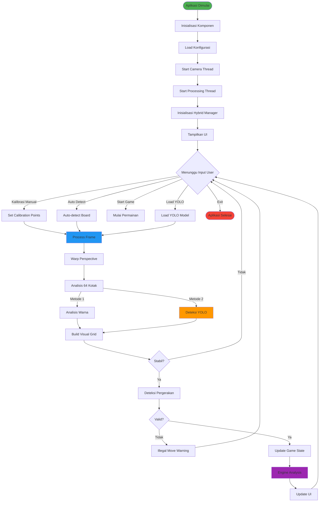
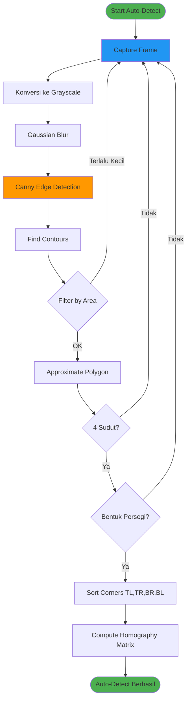
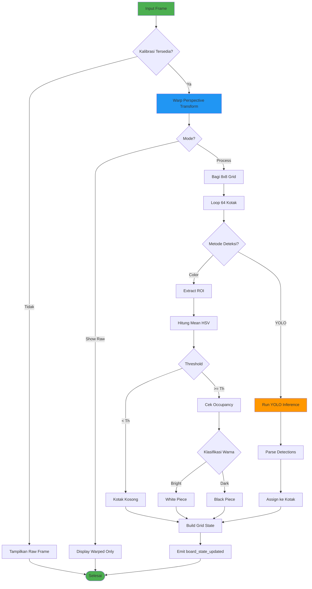

# Diagram Alur Kerja Sistem

## 1. Alur Kerja Utama (Main Workflow)

```mermaid
flowchart TD
    Start([Aplikasi Dimulai]) --> Init[Inisialisasi Komponen]
    Init --> LoadConfig[Load Konfigurasi]
    LoadConfig --> StartCamera[Start Camera Thread]
    StartCamera --> StartProcessing[Start Processing Thread]
    StartProcessing --> InitHybrid[Inisialisasi Hybrid Manager]
    InitHybrid --> ShowUI[Tampilkan UI]
    
    ShowUI --> WaitInput{Menunggu Input User}
    
    WaitInput -->|Kalibrasi Manual| Calibrate[Set Calibration Points]
    WaitInput -->|Auto Detect| AutoDetect[Auto-detect Board]
    WaitInput -->|Start Game| StartGame[Mulai Permainan]
    WaitInput -->|Load YOLO| LoadYOLO[Load YOLO Model]
    
    Calibrate --> ProcessFrame[Process Frame]
    AutoDetect --> ProcessFrame
    LoadYOLO --> ProcessFrame
    
    ProcessFrame --> WarpPerspective[Warp Perspective]
    WarpPerspective --> AnalyzeSquares[Analisis 64 Kotak]
    
    AnalyzeSquares -->|Metode 1| ColorAnalysis[Analisis Warna]
    AnalyzeSquares -->|Metode 2| YOLODetection[Deteksi YOLO]
    
    ColorAnalysis --> BuildGrid[Build Visual Grid]
    YOLODetection --> BuildGrid
    
    BuildGrid --> StabilityCheck{Stabil?}
    StabilityCheck -->|Tidak| WaitInput
    StabilityCheck -->|Ya| DetectMove[Deteksi Pergerakan]
    
    DetectMove --> ValidateMove{Valid?}
    ValidateMove -->|Tidak| IllegalMove[Illegal Move Warning]
    ValidateMove -->|Ya| UpdateState[Update Game State]
    
    IllegalMove --> WaitInput
    UpdateState --> EngineAnalysis[Engine Analysis]
    EngineAnalysis --> UpdateUI[Update UI]
    UpdateUI --> WaitInput
    
    WaitInput -->|Exit| End([Aplikasi Selesai])
    
    style Start fill:#4CAF50
    style End fill:#F44336
    style ProcessFrame fill:#2196F3
    style YOLODetection fill:#FF9800
    style EngineAnalysis fill:#9C27B0
```

## 2. Alur Deteksi Papan Otomatis

```mermaid
flowchart TD
    Start([Start Auto-Detect]) --> CaptureFrame[Capture Frame]
    CaptureFrame --> Grayscale[Konversi ke Grayscale]
    Grayscale --> Blur[Gaussian Blur]
    Blur --> Canny[Canny Edge Detection]
    
    Canny --> FindContours[Find Contours]
    FindContours --> FilterContours{Filter by Area}
    
    FilterContours -->|Terlalu Kecil| CaptureFrame
    FilterContours -->|OK| ApproxPoly[Approximate Polygon]
    
    ApproxPoly --> CheckQuad{4 Sudut?}
    CheckQuad -->|Tidak| CaptureFrame
    CheckQuad -->|Ya| ValidateShape{Bentuk Persegi?}
    
    ValidateShape -->|Tidak| CaptureFrame
    ValidateShape -->|Ya| SortCorners[Sort Corners TL,TR,BR,BL]
    
    SortCorners --> ComputeHomography[Compute Homography Matrix]
    ComputeHomography --> Success([Auto-Detect Berhasil])
    
    style Start fill:#4CAF50
    style Success fill:#4CAF50
    style CaptureFrame fill:#2196F3
    style Canny fill:#FF9800
```

## 3. Alur Pemrosesan Frame

```mermaid
flowchart TD
    Frame[Input Frame] --> CheckCalib{Kalibrasi Tersedia?}
    CheckCalib -->|Tidak| ShowRaw[Tampilkan Raw Frame]
    CheckCalib -->|Ya| WarpPerspective[Warp Perspective Transform]
    
    WarpPerspective --> CheckMode{Mode?}
    CheckMode -->|Show Raw| DisplayWarped[Display Warped Only]
    CheckMode -->|Process| DivideGrid[Bagi 8x8 Grid]
    
    DivideGrid --> LoopSquares[Loop 64 Kotak]
    LoopSquares --> CheckMethod{Metode Deteksi?}
    
    CheckMethod -->|Color| ExtractROI[Extract ROI]
    CheckMethod -->|YOLO| RunYOLO[Run YOLO Inference]
    
    ExtractROI --> CalcMean[Hitung Mean HSV]
    CalcMean --> Threshold{Threshold}
    Threshold -->|< Th| Empty[Kotak Kosong]
    Threshold -->|>= Th| OccupancyCheck[Cek Occupancy]
    
    OccupancyCheck --> ColorClassify{Klasifikasi Warna}
    ColorClassify -->|Bright| White[White Piece]
    ColorClassify -->|Dark| Black[Black Piece]
    
    RunYOLO --> ParseDetections[Parse Detections]
    ParseDetections --> AssignSquare[Assign ke Kotak]
    
    Empty --> BuildGrid[Build Grid State]
    White --> BuildGrid
    Black --> BuildGrid
    AssignSquare --> BuildGrid
    
    BuildGrid --> EmitSignal[Emit board_state_updated]
    EmitSignal --> End([Selesai])
    
    ShowRaw --> End
    DisplayWarped --> End
    
    style Frame fill:#4CAF50
    style End fill:#4CAF50
    style WarpPerspective fill:#2196F3
    style RunYOLO fill:#FF9800
```
