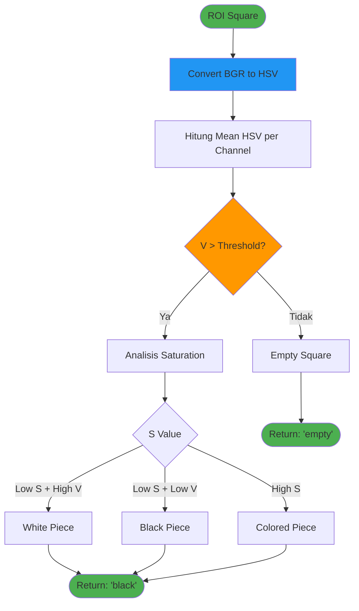
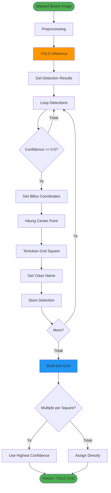
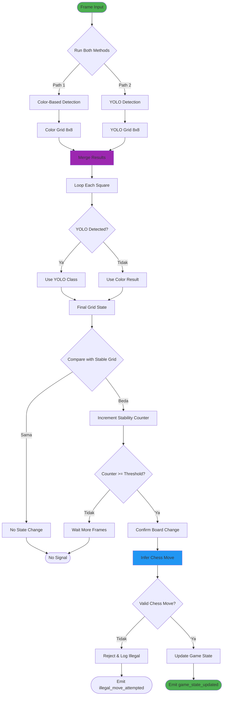

# Diagram Metode Deteksi

## 1. Metode Color-Based Detection

### Parameter Color Detection:
- **HSV Conversion**: BGR → HSV color space
- **Occupancy Threshold**: Default 50 (adjustable)
- **White Detection**: S < 30, V > 180
- **Black Detection**: S < 30, V < 80
- **Empty Detection**: V < Threshold

## 2. Metode YOLO Object Detection

### YOLO Classes:
- white-pawn, white-rook, white-knight, white-bishop, white-queen, white-king
- black-pawn, black-rook, black-knight, black-bishop, black-queen, black-king

### Parameter YOLO Detection:
- **Model**: YOLOv8 Custom Trained
- **Input Size**: 640x640
- **Confidence Threshold**: 0.5 (adjustable)
- **NMS IoU Threshold**: 0.45

## 3. Metode Hybrid (Color + YOLO)

### Hybrid Logic:
1. **Priority**: YOLO results take precedence when available
2. **Fallback**: Use color detection when YOLO fails or low confidence
3. **Stability**: Require N consecutive frames (default 5) with same state
4. **Validation**: All moves validated against chess.Board legal moves
