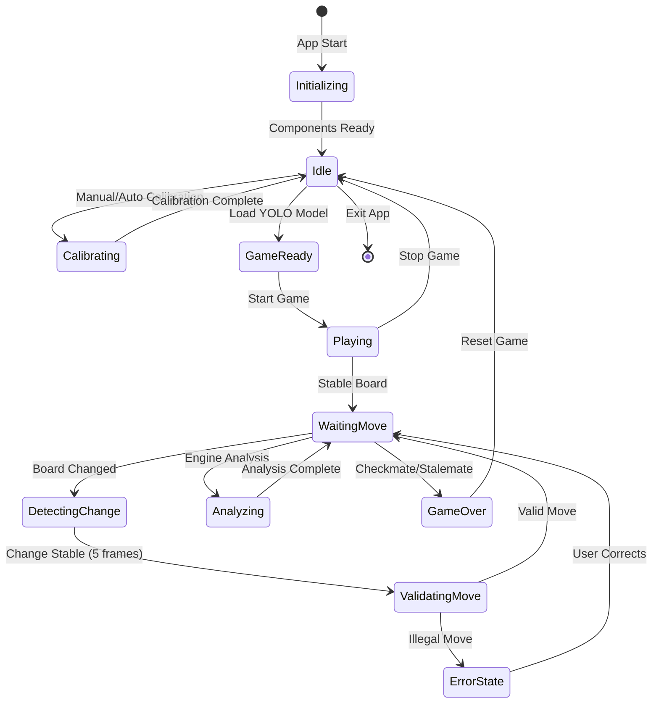
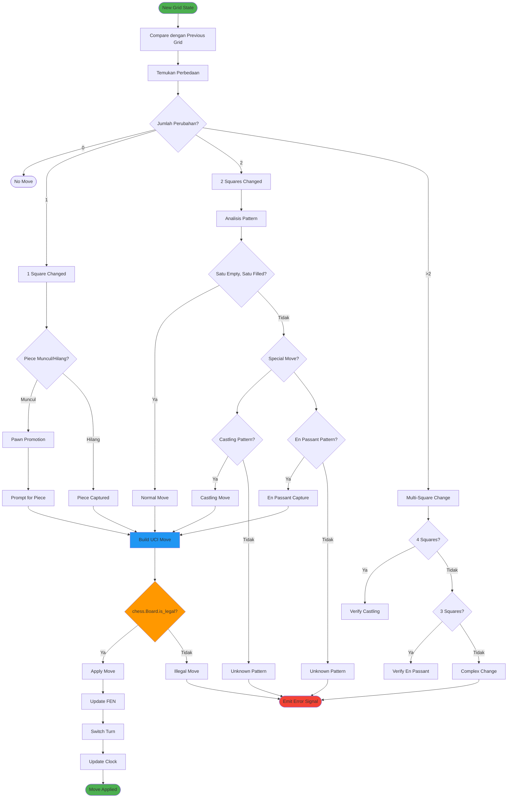
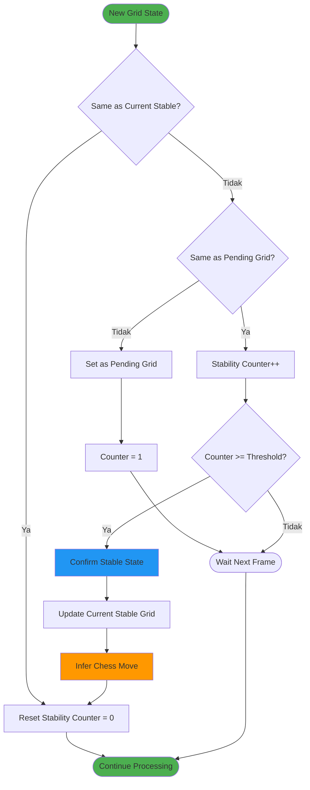

# Diagram State Management & Game Logic

## 1. State Management Flow

## 2. Move Inference Algorithm

## 3. Stability Checking Mechanism

### Stability Parameters:
- **Stability Threshold**: 5 frames (default)
- **Purpose**: Menghindari false positive dari noise/gerakan tangan
- **Frame Rate**: ~30 FPS, jadi ~166ms delay
