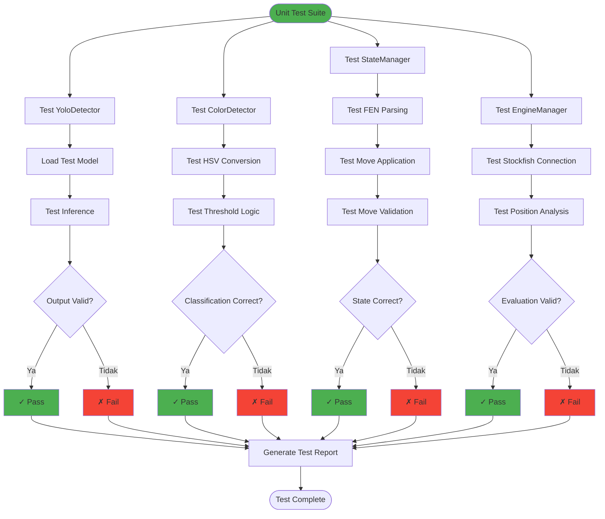
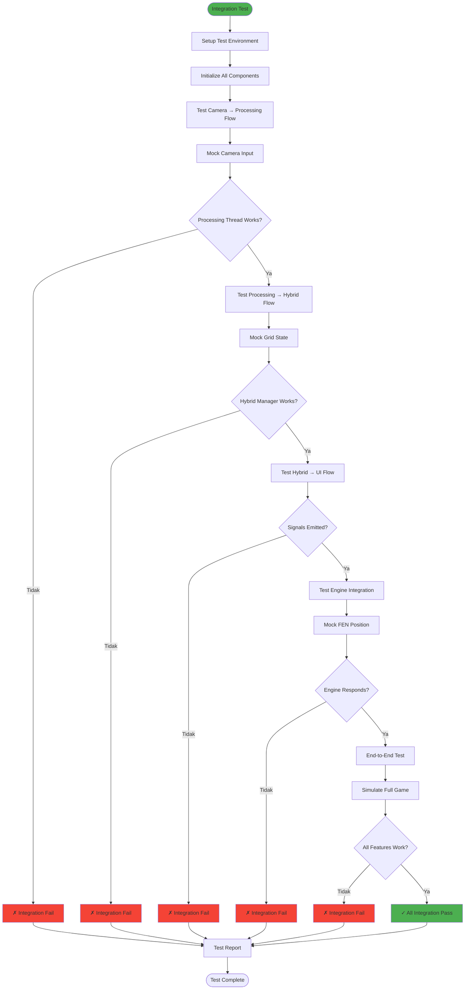

# Metode Pengujian (Testing Methods)

## 1. Unit Testing Flow



## 2. Integration Testing Flow



## 3. Accuracy Testing (Detection)

```mermaid
flowchart TD
    Start([Accuracy Test]) --> PrepareDataset[Prepare Test Dataset]
    PrepareDataset --> LoadImages[Load 100 Test Images]
    
    LoadImages --> LoadGroundTruth[Load Ground Truth Annotations]
    LoadGroundTruth --> InitMetrics[Initialize Metrics: TP, FP, FN, TN]
    
    InitMetrics --> LoopImages[Loop Each Image]
    LoopImages --> RunDetection[Run Detection Algorithm]
    
    RunDetection --> CompareResults[Compare with Ground Truth]
    CompareResults --> CountMetrics[Count TP, FP, FN, TN]
    
    CountMetrics --> MoreImages{More Images?}
    MoreImages -->|Ya| LoopImages
    MoreImages -->|Tidak| Calculate[Calculate Metrics]
    
    Calculate --> CalcPrecision[Precision = TP/(TP+FP)]
    CalcPrecision --> CalcRecall[Recall = TP/(TP+FN)]
    CalcRecall --> CalcF1[F1-Score = 2×(P×R)/(P+R)]
    CalcF1 --> CalcAccuracy[Accuracy = (TP+TN)/Total]
    
    CalcAccuracy --> CheckTarget{Accuracy >= Target?}
    CheckTarget -->|Ya, >= 90%| Pass[✓ Test Pass]
    CheckTarget -->|Tidak, < 90%| Fail[✗ Test Fail - Needs Improvement]
    
    Pass --> GenerateReport[Generate Detailed Report]
    Fail --> GenerateReport
    
    GenerateReport --> SaveReport[Save Report & Confusion Matrix]
    SaveReport --> End([Test Complete])
    
    style Start fill:#4CAF50
    style Pass fill:#4CAF50
    style Fail fill:#F44336
    style Calculate fill:#2196F3
```

### Metrics Definition:
- **True Positive (TP)**: Deteksi benar, piece yang terdeteksi sesuai ground truth
- **False Positive (FP)**: Deteksi salah, mendeteksi piece yang tidak ada
- **False Negative (FN)**: Miss detection, piece ada tapi tidak terdeteksi
- **True Negative (TN)**: Kotak kosong terdeteksi dengan benar

### Target Metrics:
- **Precision**: ≥ 90%
- **Recall**: ≥ 85%
- **F1-Score**: ≥ 87%
- **Accuracy**: ≥ 90%

## 4. Performance Testing

```mermaid
flowchart TD
    Start([Performance Test]) --> SetupMonitor[Setup Performance Monitor]
    SetupMonitor --> TestFPS[Test Frame Rate]
    
    TestFPS --> RunCamera[Run Camera Thread]
    RunCamera --> MeasureFPS[Measure FPS for 60s]
    MeasureFPS --> CheckFPS{FPS >= 25?}
    CheckFPS -->|Ya| PassFPS[✓ FPS OK]
    CheckFPS -->|Tidak| FailFPS[✗ FPS Low]
    
    PassFPS --> TestLatency[Test Detection Latency]
    FailFPS --> TestLatency
    
    TestLatency --> MeasureTime[Measure Processing Time]
    MeasureTime --> CheckLatency{Latency < 100ms?}
    CheckLatency -->|Ya| PassLatency[✓ Latency OK]
    CheckLatency -->|Tidak| FailLatency[✗ Latency High]
    
    PassLatency --> TestMemory[Test Memory Usage]
    FailLatency --> TestMemory
    
    TestMemory --> MonitorRAM[Monitor RAM Usage]
    MonitorRAM --> CheckMemory{Memory < 500MB?}
    CheckMemory -->|Ya| PassMemory[✓ Memory OK]
    CheckMemory -->|Tidak| FailMemory[✗ Memory High]
    
    PassMemory --> TestCPU[Test CPU Usage]
    FailMemory --> TestCPU
    
    TestCPU --> MonitorCPU[Monitor CPU %]
    MonitorCPU --> CheckCPU{CPU < 70%?}
    CheckCPU -->|Ya| PassCPU[✓ CPU OK]
    CheckCPU -->|Tidak| FailCPU[✗ CPU High]
    
    PassCPU --> Report[Generate Performance Report]
    FailCPU --> Report
    
    Report --> End([Test Complete])
    
    style Start fill:#4CAF50
    style PassFPS fill:#4CAF50
    style PassLatency fill:#4CAF50
    style PassMemory fill:#4CAF50
    style PassCPU fill:#4CAF50
    style FailFPS fill:#F44336
    style FailLatency fill:#F44336
    style FailMemory fill:#F44336
    style FailCPU fill:#F44336
```



### Performance Targets:
- **Frame Rate**: ≥ 25 FPS
- **Processing Latency**: < 100ms per frame
- **Memory Usage**: < 500 MB
- **CPU Usage**: < 70% (average)
