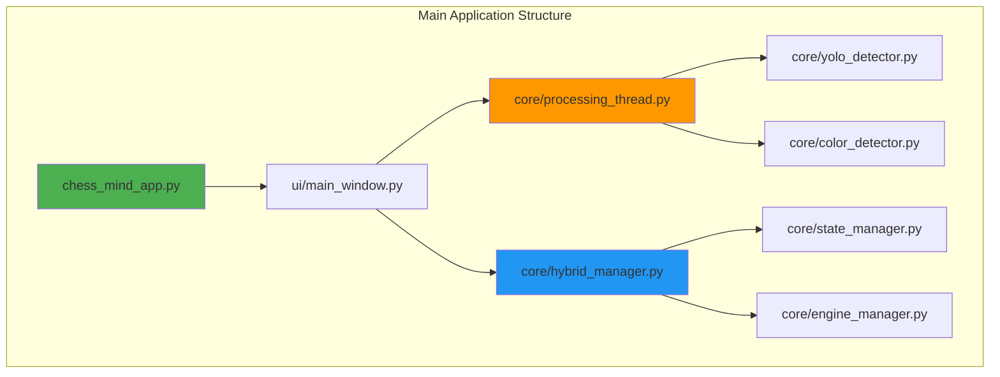
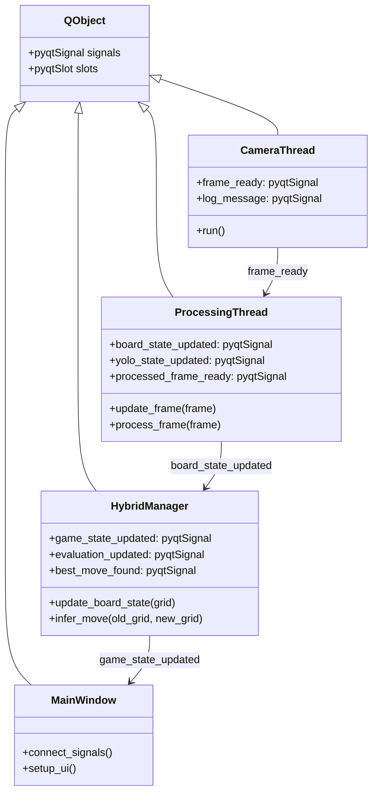
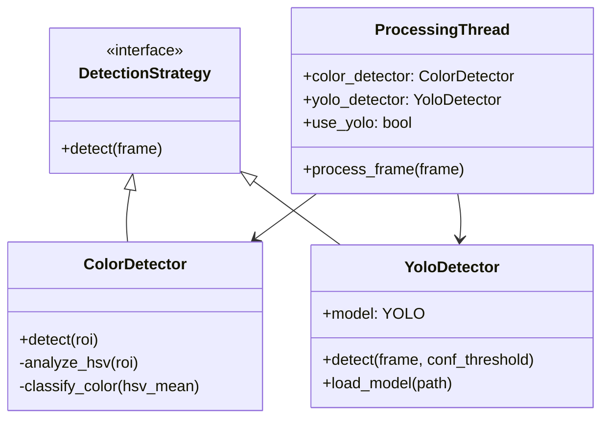
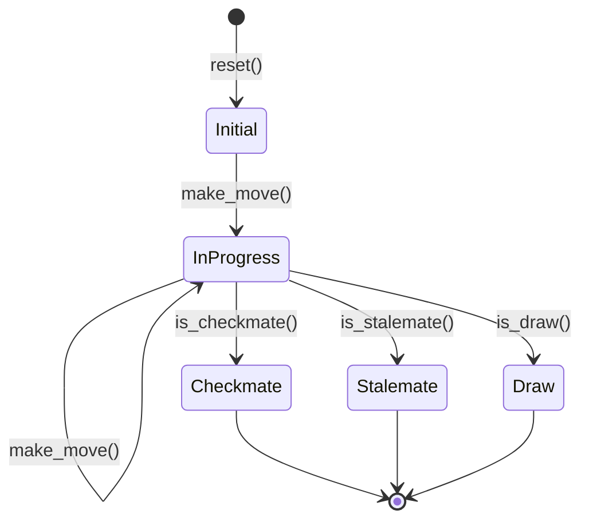
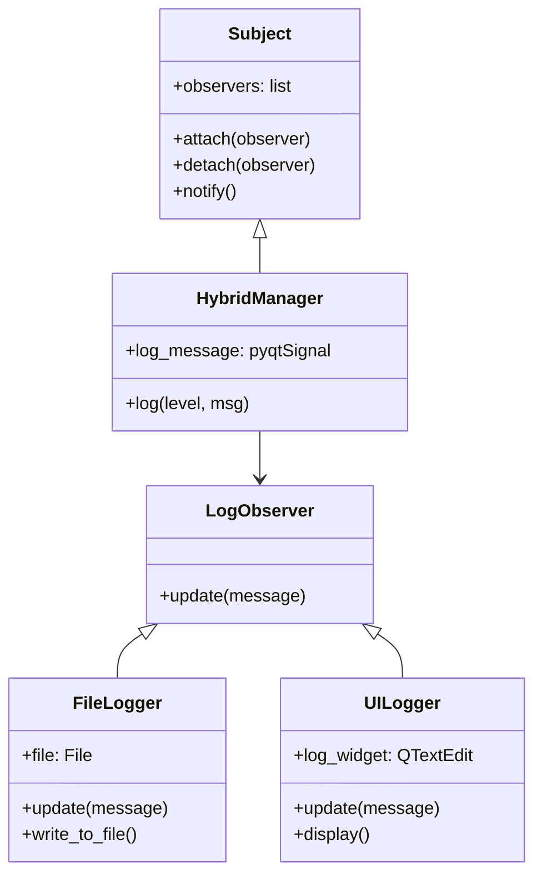

# Format Kode dan Implementasi

## 1. Struktur Kode Utama



### Kode: chess_mind_app.py (Entry Point)

```python
import sys
import os
from PyQt5.QtWidgets import QApplication
from ui.main_window import MainWindow
from ui.styles import STYLESHEET

def main():
    app = QApplication(sys.argv)
    app.setStyleSheet(STYLESHEET)
    
    window = MainWindow()
    window.show()
    
    sys.exit(app.exec_())

if __name__ == "__main__":
    main()
```

## 2. Pattern: Signal-Slot (Event-Driven)



### Kode: Signal-Slot Connection

```python
# Di MainWindow.__init__()
# Camera -> Processing
self.camera_thread.frame_ready.connect(self.processing_thread.update_frame)

# Processing -> HybridManager
self.processing_thread.board_state_updated.connect(
    self.hybrid_manager.update_board_state
)

# HybridManager -> UI
self.hybrid_manager.game_state_updated.connect(
    self.board_panel.update_fen
)
self.hybrid_manager.evaluation_updated.connect(
    self.eval_panel.update_evaluation
)
```

## 3. Pattern: Strategy Pattern (Detection Methods)



### Kode: Color Detection

```python
class ColorDetector:
    def detect(self, roi):
        """Deteksi warna pada ROI (region of interest)"""
        hsv = cv2.cvtColor(roi, cv2.COLOR_BGR2HSV)
        h, s, v = cv2.mean(hsv)[:3]
        
        # Occupancy check
        if v < self.occupancy_threshold:
            return 'empty'
        
        # Color classification
        if s < 30:
            return 'white' if v > 180 else 'black'
        
        return 'colored'
```

### Kode: YOLO Detection

```python
class YoloDetector:
    def __init__(self):
        self.model = None
        
    def load_model(self, model_path):
        """Load YOLO model"""
        self.model = YOLO(model_path)
        self.class_names = self.model.names
        return True
        
    def detect(self, frame, conf_threshold=0.5):
        """Run YOLO inference"""
        results = self.model(frame, conf=conf_threshold, verbose=False)
        
        detections = []
        for result in results:
            for box in result.boxes:
                x1, y1, x2, y2 = box.xyxy[0].tolist()
                conf = float(box.conf[0])
                cls = int(box.cls[0])
                class_name = self.class_names.get(cls, str(cls))
                
                detections.append({
                    'class_name': class_name,
                    'conf': conf,
                    'bbox': [x1, y1, x2, y2]
                })
        
        return detections
```

## 4. Pattern: State Pattern (Game State)



### Kode: State Manager

```python
class StateManager:
    def __init__(self):
        self.board = chess.Board()
        self.move_history = []
        
    def reset(self):
        """Reset ke posisi awal"""
        self.board = chess.Board()
        self.move_history = []
        
    def make_move(self, uci_move):
        """Apply move dan validasi"""
        move = chess.Move.from_uci(uci_move)
        
        if not self.board.is_legal(move):
            return False, "Illegal move"
            
        self.board.push(move)
        self.move_history.append(uci_move)
        return True, "Move applied"
        
    def get_fen(self):
        """Get current FEN"""
        return self.board.fen()
        
    def get_pgn(self):
        """Export ke PGN format"""
        game = chess.pgn.Game()
        game.headers["Event"] = "ChessMind Game"
        node = game
        
        board = chess.Board()
        for uci in self.move_history:
            move = chess.Move.from_uci(uci)
            node = node.add_variation(move)
            
        return str(game)
```

## 5. Pattern: Observer Pattern (Logging)



### Kode: Logging System

```python
# Emit log message (Subject)
class HybridManager(QObject):
    log_message = pyqtSignal(str, str)  # level, message
    
    def log(self, level, message):
        """Emit log to all observers"""
        self.log_message.emit(level, message)

# Observer: UI Logger
class LogViewPanel(QWidget):
    def __init__(self):
        super().__init__()
        self.log_text = QTextEdit()
        
    def add_entry(self, level, message):
        """Update UI with log message"""
        timestamp = datetime.now().strftime("%H:%M:%S")
        color = self.get_color_for_level(level)
        html = f'<span style="color:{color}">[{timestamp}] [{level}] {message}</span>'
        self.log_text.append(html)
```
