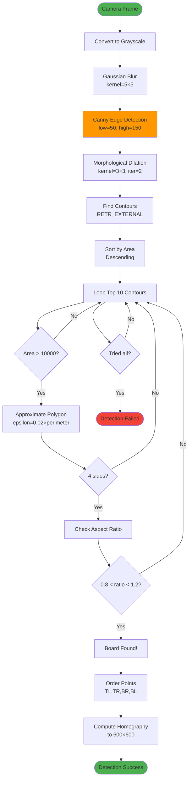

# Computer Vision Pipeline

## 1. Image Processing Pipeline

```mermaid
flowchart LR
    Input[Raw Camera Frame<br/>1920×1080 BGR] --> Calibration{Calibrated?}
    
    Calibration -->|No| Display1[Display Raw]
    Calibration -->|Yes| Warp[Perspective Transform<br/>600×600]
    
    Warp --> Method{Detection Method?}
    
    Method -->|Color| ColorPipeline[Color Processing]
    Method -->|YOLO| YOLOPipeline[YOLO Processing]
    Method -->|Hybrid| Both[Both Pipelines]
    
    ColorPipeline --> Grid1[8×8 Grid Division]
    YOLOPipeline --> Inference[Model Inference]
    Both --> Grid1
    Both --> Inference
    
    Grid1 --> ROI[Extract ROI<br/>75×75 per square]
    ROI --> HSV[BGR → HSV Conversion]
    HSV --> Stats[Calculate Mean H,S,V]
    Stats --> Classify[Color Classification]
    Classify --> ColorGrid[Color Grid Result]
    
    Inference --> Parse[Parse Detections]
    Parse --> Assign[Assign to Squares]
    Assign --> YOLOGrid[YOLO Grid Result]
    
    ColorGrid --> Merge[Merge Results]
    YOLOGrid --> Merge
    
    Merge --> Final[Final 8×8 State]
    Final --> Emit[Emit Signal]
    
    Display1 --> End([Display])
    Emit --> End
    
    style Input fill:#4CAF50
    style Warp fill:#2196F3
    style ColorPipeline fill:#FF9800
    style YOLOPipeline fill:#9C27B0
    style Final fill:#4CAF50
```



## 2. Board Detection Pipeline



### Code: Board Detection

```python
def detect_board(self, frame):
    """Auto-detect chessboard using edge detection"""
    gray = cv2.cvtColor(frame, cv2.COLOR_BGR2GRAY)
    blurred = cv2.GaussianBlur(gray, (5, 5), 0)
    
    # Canny edge detection
    edges = cv2.Canny(blurred, self.canny_lower, self.canny_upper)
    
    # Morphological operations
    kernel = np.ones((3, 3), np.uint8)
    dilated = cv2.dilate(edges, kernel, iterations=2)
    
    # Find contours
    contours, _ = cv2.findContours(
        dilated, cv2.RETR_EXTERNAL, cv2.CHAIN_APPROX_SIMPLE
    )
    
    # Sort by area
    contours = sorted(contours, key=cv2.contourArea, reverse=True)
    
    for contour in contours[:10]:
        area = cv2.contourArea(contour)
        if area < 10000:
            continue
            
        # Approximate polygon
        peri = cv2.arcLength(contour, True)
        approx = cv2.approxPolyDP(contour, 0.02 * peri, True)
        
        # Check if 4 sides
        if len(approx) == 4:
            # Check aspect ratio
            x, y, w, h = cv2.boundingRect(approx)
            aspect_ratio = float(w) / h
            
            if 0.8 < aspect_ratio < 1.2:
                # Found chessboard!
                points = approx.reshape(4, 2).tolist()
                self.set_calibration_points(points)
                self.stop_auto_detect()
                return True
    
    return False
```

## 3. Perspective Transformation

```mermaid
flowchart TD
    Start([4 Corner Points]) --> Sort[Sort Points<br/>TL, TR, BR, BL]
    
    Sort --> Calc[Calculate by:<br/>- sum = x+y<br/>- diff = y-x]
    
    Calc --> Assign[Assign:<br/>TL = min(sum)<br/>BR = max(sum)<br/>TR = min(diff)<br/>BL = max(diff)]
    
    Assign --> SrcPts[Source Points<br/>4×2 array]
    SrcPts --> DstPts[Destination Points<br/>[0,0], [W,0], [W,H], [0,H]]
    
    DstPts --> Homography[cv2.getPerspectiveTransform]
    Homography --> Matrix[Homography Matrix 3×3]
    
    Matrix --> Store[Store Matrix]
    Store --> Ready([Ready for Warping])
    
    Ready --> WarpLoop[For each frame:]
    WarpLoop --> Apply[cv2.warpPerspective]
    Apply --> Warped[Warped Image 600×600]
    Warped --> WarpLoop
    
    style Start fill:#4CAF50
    style Matrix fill:#2196F3
    style Warped fill:#4CAF50
```

### Code: Perspective Transform

```python
def set_calibration_points(self, points):
    """Compute homography matrix from 4 points"""
    pts = np.array(points, dtype="float32")
    
    # Sort points
    s = pts.sum(axis=1)
    diff = np.diff(pts, axis=1)
    
    self.calibration_points = np.zeros((4, 2), dtype="float32")
    self.calibration_points[0] = pts[np.argmin(s)]      # Top-Left
    self.calibration_points[2] = pts[np.argmax(s)]      # Bottom-Right
    self.calibration_points[1] = pts[np.argmin(diff)]   # Top-Right
    self.calibration_points[3] = pts[np.argmax(diff)]   # Bottom-Left
    
    # Define destination points
    size = 600
    dst_pts = np.array([
        [0, 0],
        [size - 1, 0],
        [size - 1, size - 1],
        [0, size - 1]
    ], dtype="float32")
    
    # Compute homography
    self.homography_matrix = cv2.getPerspectiveTransform(
        self.calibration_points, dst_pts
    )

def warp_frame(self, frame):
    """Apply perspective transform"""
    if self.homography_matrix is None:
        return frame
        
    warped = cv2.warpPerspective(
        frame, 
        self.homography_matrix, 
        (600, 600)
    )
    return warped
```

## 4. Grid Division & ROI Extraction

```mermaid
flowchart TD
    Start([Warped Image<br/>600×600]) --> CalcSize[Square Size = 600/8 = 75px]
    CalcSize --> InitGrid[Initialize 8×8 Grid]
    
    InitGrid --> LoopRow[For row = 0 to 7]
    LoopRow --> LoopCol[For col = 0 to 7]
    
    LoopCol --> CalcROI[Calculate ROI:<br/>x = col × 75<br/>y = row × 75<br/>w = h = 75]
    
    CalcROI --> Extract[Extract ROI:<br/>img[y:y+h, x:x+w]]
    Extract --> Process{Processing Method?}
    
    Process -->|Color| HSVConvert[BGR → HSV]
    Process -->|YOLO| SkipExtract[Use Full Image]
    
    HSVConvert --> Mean[Calculate Mean<br/>H, S, V values]
    Mean --> Threshold[Apply Threshold]
    Threshold --> Store[Store Result<br/>grid[row][col]]
    
    SkipExtract --> YOLOAssign[Assign from<br/>YOLO detections]
    YOLOAssign --> Store
    
    Store --> NextCol{col < 7?}
    NextCol -->|Yes| LoopCol
    NextCol -->|No| NextRow{row < 7?}
    NextRow -->|Yes| LoopRow
    NextRow -->|No| Complete([Grid Complete])
    
    style Start fill:#4CAF50
    style Extract fill:#2196F3
    style Complete fill:#4CAF50
```

### Code: Grid Processing

```python
def process_grid(self, warped_frame):
    """Process 8x8 grid of squares"""
    square_size = 600 // 8  # 75 pixels
    grid = [['empty'] * 8 for _ in range(8)]
    
    for row in range(8):
        for col in range(8):
            # Extract ROI
            x = col * square_size
            y = row * square_size
            roi = warped_frame[y:y+square_size, x:x+square_size]
            
            if self.use_yolo:
                # YOLO detection handles all squares at once
                # Will be assigned later
                continue
            else:
                # Color-based detection
                result = self.color_detector.detect(roi)
                grid[row][col] = result
    
    return grid
```
