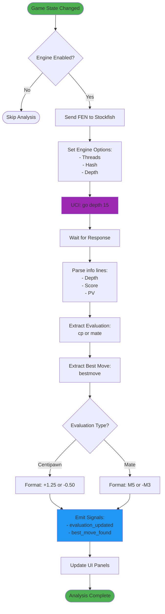
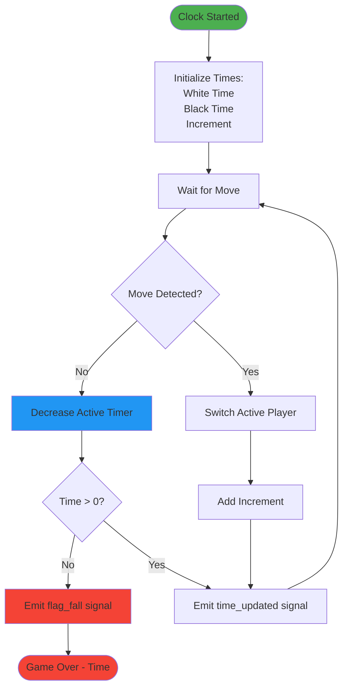

# Engine & Audio Integration

## 1. Chess Engine Integration (Stockfish)



### Code: Engine Manager

```python
import chess.engine

class EngineManager(QObject):
    evaluation_updated = pyqtSignal(str)
    best_move_found = pyqtSignal(str)
    
    def __init__(self):
        super().__init__()
        self.engine = None
        self.engine_path = "/usr/local/bin/stockfish"
        
    def start_engine(self):
        """Initialize Stockfish engine"""
        try:
            self.engine = chess.engine.SimpleEngine.popen_uci(
                self.engine_path
            )
            # Configure engine
            self.engine.configure({
                "Threads": 2,
                "Hash": 128,
            })
            print("Engine started successfully")
            return True
        except Exception as e:
            print(f"Failed to start engine: {e}")
            return False
    
    def analyze_position(self, fen, depth=15):
        """Analyze chess position"""
        if not self.engine:
            return
            
        board = chess.Board(fen)
        
        # Run analysis
        info = self.engine.analyse(
            board, 
            chess.engine.Limit(depth=depth)
        )
        
        # Extract evaluation
        score = info.get("score")
        if score:
            if score.is_mate():
                mate_in = score.relative.mate()
                eval_str = f"M{abs(mate_in)}" if mate_in > 0 else f"-M{abs(mate_in)}"
            else:
                cp = score.relative.score()
                eval_str = f"+{cp/100:.2f}" if cp > 0 else f"{cp/100:.2f}"
            
            self.evaluation_updated.emit(eval_str)
        
        # Extract best move
        best_move = info.get("pv", [None])[0]
        if best_move:
            self.best_move_found.emit(best_move.uci())
    
    def stop_analysis(self):
        """Stop ongoing analysis"""
        if self.engine:
            # Stop is automatic when new analysis starts
            pass
    
    def shutdown(self):
        """Shutdown engine"""
        if self.engine:
            self.engine.quit()
            self.engine = None
```

## 2. Audio Feedback System

```mermaid
flowchart TD
    Start([Move Applied]) --> CheckAudio{Audio Enabled?}
    CheckAudio -->|No| Skip([No Sound])
    CheckAudio -->|Yes| GetMove[Get Move Info]
    
    GetMove --> ParseMove[Parse UCI Move:<br/>- From Square<br/>- To Square<br/>- Piece Type]
    
    ParseMove --> BuildMessage[Build Message:<br/>"Knight from e4 to f6"]
    BuildMessage --> CheckSpecial{Special Move?}
    
    CheckSpecial -->|Castling| AddCastling["Add: Castling"]
    CheckSpecial -->|Capture| AddCapture["Add: Captures"]
    CheckSpecial -->|Check| AddCheck["Add: Check"]
    CheckSpecial -->|Checkmate| AddCheckmate["Add: Checkmate"]
    CheckSpecial -->|Normal| NormalMove[Regular Move]
    
    AddCastling --> Speak
    AddCapture --> Speak
    AddCheck --> Speak
    AddCheckmate --> Speak
    NormalMove --> Speak[Speak Message]
    
    Speak --> CheckPlatform{Platform?}
    CheckPlatform -->|macOS| UseSay[Use 'say' command]
    CheckPlatform -->|Linux| UseEspeak[Use 'espeak']
    CheckPlatform -->|Windows| UseSAPI[Use SAPI]
    
    UseSay --> Execute[Execute TTS]
    UseEspeak --> Execute
    UseSAPI --> Execute
    
    Execute --> PlaySound[Play Move Sound]
    PlaySound --> End([Audio Complete])
    
    style Start fill:#4CAF50
    style Speak fill:#FF9800
    style Execute fill:#9C27B0
    style End fill:#4CAF50
```

### Code: Audio Manager

```python
import subprocess
import platform

class AudioManager:
    def __init__(self):
        self.enabled = True
        self.system = platform.system()
        
    def speak(self, text):
        """Text-to-speech announcement"""
        if not self.enabled:
            return
            
        try:
            if self.system == "Darwin":  # macOS
                subprocess.Popen(['say', text])
            elif self.system == "Linux":
                subprocess.Popen(['espeak', text])
            elif self.system == "Windows":
                # Use pyttsx3 for Windows
                import pyttsx3
                engine = pyttsx3.init()
                engine.say(text)
                engine.runAndWait()
        except Exception as e:
            print(f"TTS Error: {e}")
    
    def announce_move(self, move_uci, board):
        """Announce chess move in natural language"""
        move = chess.Move.from_uci(move_uci)
        
        # Get piece name
        piece = board.piece_at(move.from_square)
        piece_name = chess.piece_name(piece.piece_type)
        
        # Get square names
        from_square = chess.square_name(move.from_square)
        to_square = chess.square_name(move.to_square)
        
        # Build message
        message = f"{piece_name} from {from_square} to {to_square}"
        
        # Check for capture
        if board.is_capture(move):
            message += ", captures"
        
        # Check for check/checkmate
        board.push(move)
        if board.is_checkmate():
            message += ", checkmate!"
        elif board.is_check():
            message += ", check"
        board.pop()
        
        self.speak(message)
    
    def play_sound(self, sound_type):
        """Play sound effect"""
        # sound_type: 'move', 'capture', 'check', 'illegal'
        # Implementation with pygame or similar
        pass
```

## 3. Chess Clock System



### Code: Chess Clock

```python
from PyQt5.QtCore import QTimer, QObject, pyqtSignal

class ChessClock(QObject):
    time_updated = pyqtSignal(float, float)  # white_time, black_time
    flag_fall = pyqtSignal(bool)  # is_white
    
    def __init__(self):
        super().__init__()
        self.white_time = 600.0  # seconds
        self.black_time = 600.0
        self.increment = 0.0
        self.is_white_turn = True
        self.timer = QTimer()
        self.timer.timeout.connect(self.tick)
        
    def start_game(self, time_control, increment):
        """Start clock with time control"""
        self.white_time = time_control
        self.black_time = time_control
        self.increment = increment
        self.is_white_turn = True
        self.timer.start(100)  # Update every 100ms
        
    def tick(self):
        """Decrease time for active player"""
        if self.is_white_turn:
            self.white_time -= 0.1
            if self.white_time <= 0:
                self.white_time = 0
                self.timer.stop()
                self.flag_fall.emit(True)
        else:
            self.black_time -= 0.1
            if self.black_time <= 0:
                self.black_time = 0
                self.timer.stop()
                self.flag_fall.emit(False)
        
        self.time_updated.emit(self.white_time, self.black_time)
    
    def switch_turn(self):
        """Switch active player and add increment"""
        if self.is_white_turn:
            self.white_time += self.increment
        else:
            self.black_time += self.increment
            
        self.is_white_turn = not self.is_white_turn
    
    def stop(self):
        """Stop clock"""
        self.timer.stop()
```
