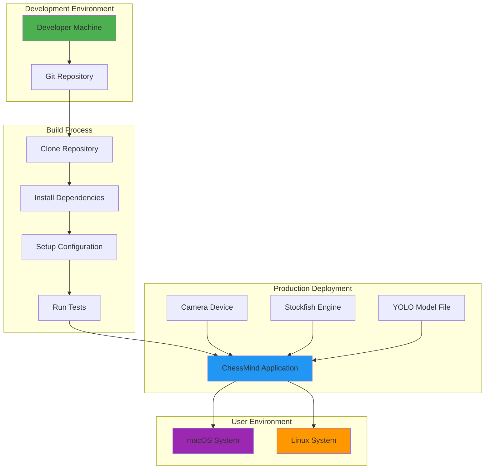
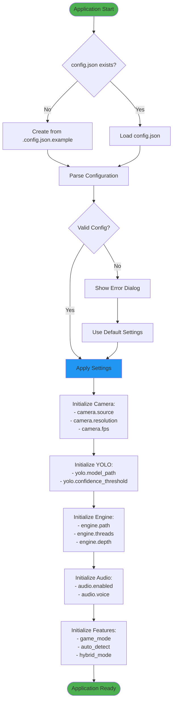
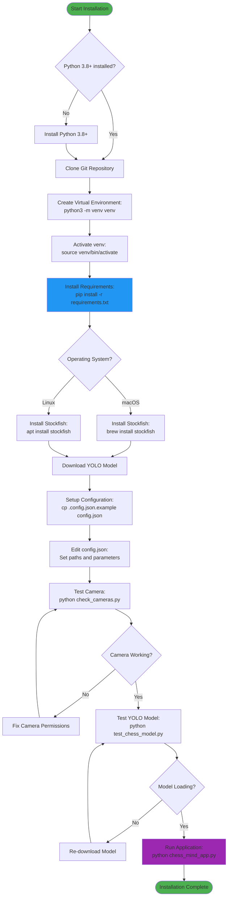
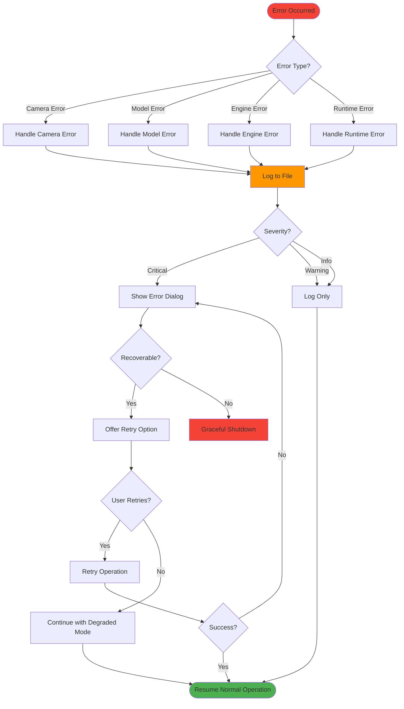

# Deployment & Configuration

## 1. Deployment Architecture



## 2. Configuration Flow



### Configuration File Structure

```json
{
  "camera": {
    "source": 0,
    "resolution": [1920, 1080],
    "fps": 30
  },
  "yolo": {
    "model_path": "models/chess_yolo.pt",
    "confidence_threshold": 0.5,
    "iou_threshold": 0.45
  },
  "engine": {
    "path": "/usr/local/bin/stockfish",
    "threads": 2,
    "hash": 128,
    "depth": 15
  },
  "audio": {
    "enabled": true,
    "voice": "default",
    "rate": 175
  },
  "features": {
    "game_mode": true,
    "auto_detect": false,
    "hybrid_mode": true,
    "show_debug": false
  },
  "processing": {
    "stability_threshold": 5,
    "occupancy_threshold": 50,
    "canny_lower": 50,
    "canny_upper": 150
  }
}
```

## 3. Installation & Setup Process



### Installation Commands

```bash
# 1. Clone Repository
git clone https://github.com/your-repo/chess-mind-hybrid.git
cd chess-mind-hybrid/chess_hybrid

# 2. Create Virtual Environment
python3 -m venv venv
source venv/bin/activate  # On Windows: venv\Scripts\activate

# 3. Install Dependencies
pip install --upgrade pip
pip install -r requirements.txt

# 4. Install Stockfish
# macOS:
brew install stockfish

# Linux:
sudo apt update
sudo apt install stockfish

# 5. Download YOLO Model
python download_model.py

# 6. Setup Configuration
cp .config.json.example config.json
# Edit config.json as needed

# 7. Test Components
python check_cameras.py
python test_chess_model.py

# 8. Run Application
python chess_mind_app.py
```

## 4. Error Handling & Logging



### Log Format

```python
# Log Entry Format
[TIMESTAMP] [LEVEL] [COMPONENT] Message

# Example:
[2025-01-26 15:30:45] [INFO] [CameraThread] Camera initialized successfully
[2025-01-26 15:30:46] [WARNING] [YoloDetector] Model confidence below threshold
[2025-01-26 15:30:50] [ERROR] [EngineManager] Failed to connect to Stockfish
[2025-01-26 15:31:00] [DEBUG] [HybridManager] Stability counter: 3/5
```

### Log Levels
- **DEBUG**: Detailed diagnostic information
- **INFO**: General informational messages
- **WARNING**: Warning messages (non-critical issues)
- **ERROR**: Error messages (failures that don't stop the app)
- **CRITICAL**: Critical errors (app must shut down)
