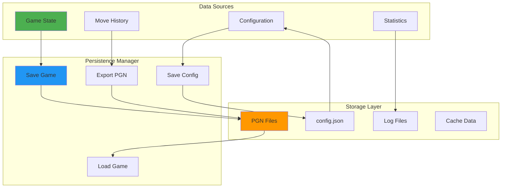
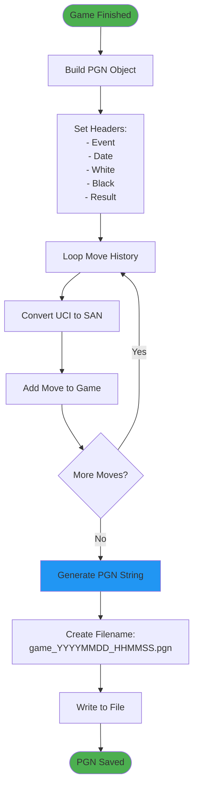
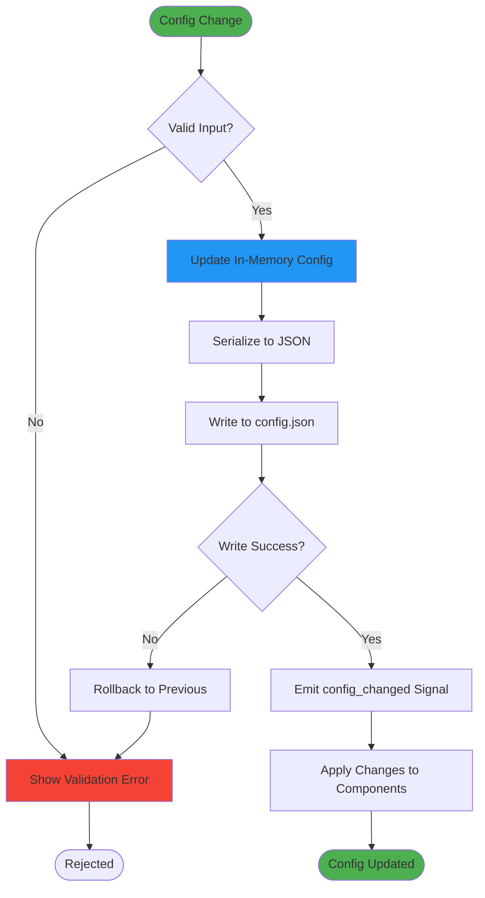
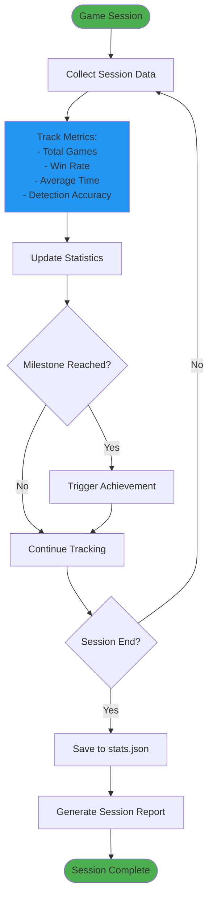

# Database & Data Persistence

## 1. Data Storage Architecture



## 2. PGN Export Flow



### PGN File Format

```pgn
[Event "ChessMind Game"]
[Site "ChessMind Hybrid System"]
[Date "2025.01.26"]
[Round "1"]
[White "Player 1"]
[Black "Player 2"]
[Result "1-0"]

1. e4 e5 2. Nf3 Nc6 3. Bb5 a6 4. Ba4 Nf6 5. O-O Be7 
6. Re1 b5 7. Bb3 d6 8. c3 O-O 9. h3 Nb8 10. d4 Nbd7
...
1-0
```

### Code: PGN Export

```python
import chess.pgn
from datetime import datetime

class PGNExporter:
    def __init__(self, state_manager):
        self.state_manager = state_manager
    
    def export_game(self, white_name="Player 1", black_name="Player 2"):
        """Export current game to PGN file"""
        game = chess.pgn.Game()
        
        # Set headers
        game.headers["Event"] = "ChessMind Game"
        game.headers["Site"] = "ChessMind Hybrid System"
        game.headers["Date"] = datetime.now().strftime("%Y.%m.%d")
        game.headers["Round"] = "1"
        game.headers["White"] = white_name
        game.headers["Black"] = black_name
        
        # Determine result
        board = self.state_manager.board
        if board.is_checkmate():
            result = "0-1" if board.turn == chess.WHITE else "1-0"
        elif board.is_stalemate() or board.is_insufficient_material():
            result = "1/2-1/2"
        else:
            result = "*"
        game.headers["Result"] = result
        
        # Add moves
        node = game
        board = chess.Board()
        for uci_move in self.state_manager.move_history:
            move = chess.Move.from_uci(uci_move)
            node = node.add_variation(move)
            board.push(move)
        
        # Generate PGN string
        pgn_string = str(game)
        
        # Save to file
        timestamp = datetime.now().strftime("%Y%m%d_%H%M%S")
        filename = f"game_{timestamp}.pgn"
        
        with open(filename, 'w') as f:
            f.write(pgn_string)
        
        return filename
```

## 3. Configuration Management



### Code: Config Manager

```python
import json
import os
from PyQt5.QtCore import QObject, pyqtSignal

class ConfigManager(QObject):
    config_changed = pyqtSignal(str, object)  # key, value
    
    def __init__(self, config_path="config.json"):
        super().__init__()
        self.config_path = config_path
        self.config = {}
        self.load_config()
    
    def load_config(self):
        """Load configuration from file"""
        if not os.path.exists(self.config_path):
            # Create from example
            if os.path.exists(".config.json.example"):
                with open(".config.json.example", 'r') as f:
                    self.config = json.load(f)
                self.save_config()
            else:
                self.config = self.get_default_config()
                self.save_config()
        else:
            with open(self.config_path, 'r') as f:
                self.config = json.load(f)
    
    def save_config(self):
        """Save configuration to file"""
        try:
            with open(self.config_path, 'w') as f:
                json.dump(self.config, f, indent=2)
            return True
        except Exception as e:
            print(f"Failed to save config: {e}")
            return False
    
    def get(self, key, default=None):
        """Get configuration value (supports dot notation)"""
        keys = key.split('.')
        value = self.config
        
        for k in keys:
            if isinstance(value, dict) and k in value:
                value = value[k]
            else:
                return default
        
        return value
    
    def set(self, key, value):
        """Set configuration value and save"""
        keys = key.split('.')
        config = self.config
        
        # Navigate to the correct nested level
        for k in keys[:-1]:
            if k not in config:
                config[k] = {}
            config = config[k]
        
        # Set the value
        config[keys[-1]] = value
        
        # Save and emit signal
        if self.save_config():
            self.config_changed.emit(key, value)
            return True
        
        return False
    
    def get_default_config(self):
        """Return default configuration"""
        return {
            "camera": {
                "source": 0,
                "resolution": [1920, 1080],
                "fps": 30
            },
            "yolo": {
                "model_path": "models/chess_yolo.pt",
                "confidence_threshold": 0.5,
                "iou_threshold": 0.45
            },
            "engine": {
                "path": "/usr/local/bin/stockfish",
                "threads": 2,
                "hash": 128,
                "depth": 15
            },
            "audio": {
                "enabled": True,
                "voice": "default",
                "rate": 175
            },
            "features": {
                "game_mode": True,
                "auto_detect": False,
                "hybrid_mode": True,
                "show_debug": False
            },
            "processing": {
                "stability_threshold": 5,
                "occupancy_threshold": 50,
                "canny_lower": 50,
                "canny_upper": 150
            }
        }
```

## 4. Statistics & Analytics



### Statistics Data Structure

```json
{
  "session_id": "uuid-here",
  "start_time": "2025-01-26T15:30:00",
  "end_time": "2025-01-26T16:45:00",
  "games_played": 5,
  "statistics": {
    "total_moves": 234,
    "average_move_time": 12.5,
    "detection_accuracy": 0.94,
    "false_positives": 3,
    "illegal_moves_attempted": 1,
    "engine_evaluations": 150
  },
  "performance": {
    "average_fps": 28.5,
    "average_latency_ms": 75,
    "peak_memory_mb": 420,
    "average_cpu_percent": 58
  }
}
```
