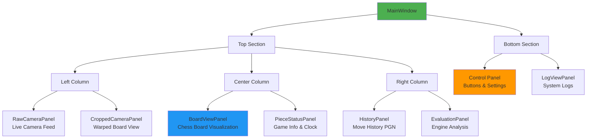
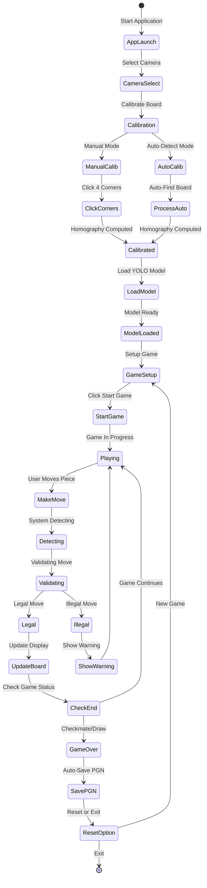
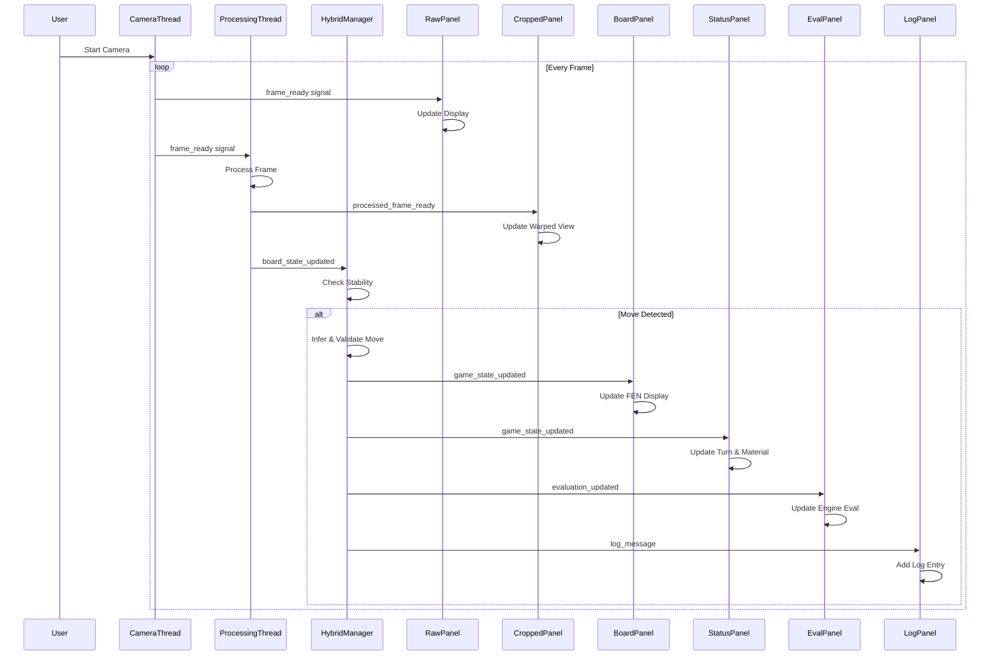
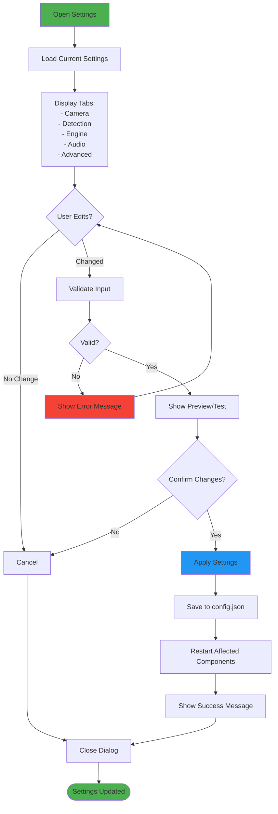
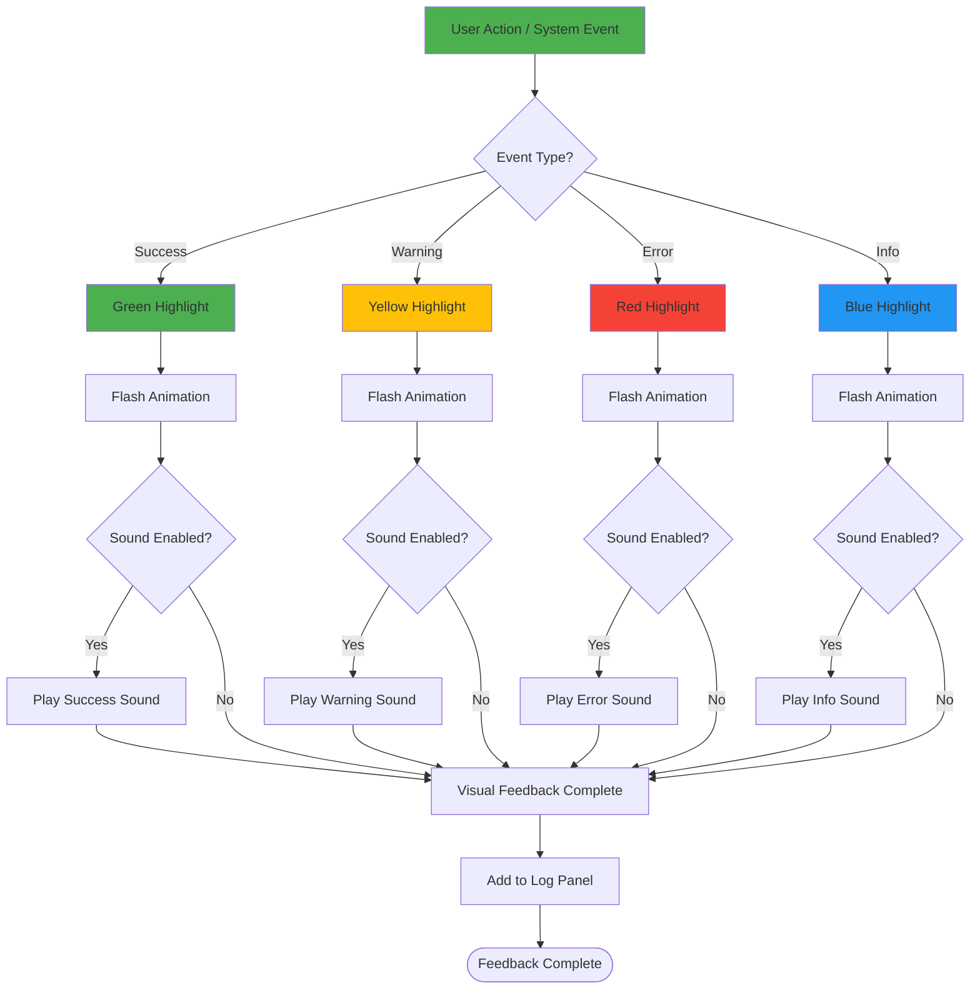

# User Interface & Interaction

## 1. UI Component Hierarchy



## 2. User Interaction Flow



## 3. Control Panel Interactions

```mermaid
flowchart TD
    Controls[Control Panel] --> CameraGroup[Camera Controls]
    Controls --> CalibGroup[Calibration Controls]
    Controls --> GameGroup[Game Controls]
    Controls --> DetectionGroup[Detection Controls]
    
    CameraGroup --> SelectCam[Select Camera Source]
    CameraGroup --> ToggleCam[Start/Stop Camera]
    
    CalibGroup --> ManualBtn[Manual Calibration]
    CalibGroup --> AutoBtn[Auto-Detect Board]
    CalibGroup --> ResetCalib[Reset Calibration]
    
    GameGroup --> StartGame[Start New Game]
    GameGroup --> ResetGame[Reset Game]
    GameGroup --> SavePGN[Export PGN]
    GameGroup --> SyncBoard[Sync from Camera]
    
    DetectionGroup --> LoadYOLO[Load YOLO Model]
    DetectionGroup --> ToggleYOLO[Enable/Disable YOLO]
    DetectionGroup --> ScanBoard[Scan Board]
    DetectionGroup --> ToggleEngine[Enable/Disable Engine]
    
    SelectCam --> Action1[Update Camera Source]
    ToggleCam --> Action2[Start/Stop Thread]
    
    ManualBtn --> Action3[Enable Click Mode]
    AutoBtn --> Action4[Start Auto-Detection]
    ResetCalib --> Action5[Clear Homography]
    
    StartGame --> Action6[Initialize Game State]
    ResetGame --> Action7[Reset to Start Position]
    SavePGN --> Action8[Export to File]
    SyncBoard --> Action9[Set Position from YOLO]
    
    LoadYOLO --> Action10[Load Model File]
    ToggleYOLO --> Action11[Switch Detection Mode]
    ScanBoard --> Action12[Run 30-Frame Scan]
    ToggleEngine --> Action13[Start/Stop Stockfish]
    
    style Controls fill:#4CAF50
    style CameraGroup fill:#2196F3
    style GameGroup fill:#FF9800
    style DetectionGroup fill:#9C27B0
```



## 4. Panel Update Flow



## 5. Settings Dialog Flow



## 6. Keyboard Shortcuts

```mermaid
graph TD
    Shortcuts[Keyboard Shortcuts] --> Camera[Camera Controls]
    Shortcuts --> Game[Game Controls]
    Shortcuts --> Detection[Detection Controls]
    Shortcuts --> View[View Controls]
    
    Camera --> C1["Space: Start/Stop Camera"]
    Camera --> C2["C: Cycle Camera Source"]
    
    Game --> G1["N: New Game"]
    Game --> G2["R: Reset Game"]
    Game --> G3["S: Save PGN"]
    Game --> G4["U: Undo Move"]
    
    Detection --> D1["A: Auto-Detect Board"]
    Detection --> D2["M: Manual Calibration"]
    Detection --> D3["Y: Toggle YOLO"]
    Detection --> D4["E: Toggle Engine"]
    
    View --> V1["F11: Fullscreen"]
    View --> V2["L: Toggle Logs"]
    View --> V3["D: Toggle Debug"]
    View --> V4["H: Show Help"]
    
    style Shortcuts fill:#4CAF50
    style Camera fill:#2196F3
    style Game fill:#FF9800
    style Detection fill:#9C27B0
    style View fill:#795548
```



### Code: Keyboard Shortcuts Implementation

```python
from PyQt5.QtCore import Qt
from PyQt5.QtWidgets import QShortcut
from PyQt5.QtGui import QKeySequence

class MainWindow(QMainWindow):
    def setup_shortcuts(self):
        """Setup keyboard shortcuts"""
        # Camera Controls
        QShortcut(QKeySequence(Qt.Key_Space), self, self.toggle_camera)
        QShortcut(QKeySequence("C"), self, self.cycle_camera)
        
        # Game Controls
        QShortcut(QKeySequence("N"), self, self.new_game)
        QShortcut(QKeySequence("R"), self, self.reset_game)
        QShortcut(QKeySequence("S"), self, self.save_pgn)
        QShortcut(QKeySequence("U"), self, self.undo_move)
        
        # Detection Controls
        QShortcut(QKeySequence("A"), self, self.auto_detect)
        QShortcut(QKeySequence("M"), self, self.manual_calibration)
        QShortcut(QKeySequence("Y"), self, self.toggle_yolo)
        QShortcut(QKeySequence("E"), self, self.toggle_engine)
        
        # View Controls
        QShortcut(QKeySequence(Qt.Key_F11), self, self.toggle_fullscreen)
        QShortcut(QKeySequence("L"), self, self.toggle_logs)
        QShortcut(QKeySequence("D"), self, self.toggle_debug)
        QShortcut(QKeySequence("H"), self, self.show_help)
```

## 7. Visual Feedback System



### Visual Feedback Examples:

1. **Move Detected (Success)**
   - Board square highlights in green
   - Success sound plays
   - Log: "[INFO] Move detected: e2e4"

2. **Illegal Move (Error)**
   - Board square highlights in red
   - Error sound plays
   - Dialog shows: "Illegal move attempted"
   - Log: "[ERROR] Illegal move: e2e5"

3. **Board Calibrated (Success)**
   - Raw camera panel border turns green
   - Success sound plays
   - Log: "[INFO] Board calibrated successfully"

4. **Model Loading (Info)**
   - Progress bar shows loading
   - Info sound plays
   - Log: "[INFO] Loading YOLO model..."

5. **Engine Analysis (Info)**
   - Evaluation panel updates
   - Log: "[INFO] Engine evaluation: +0.52"
