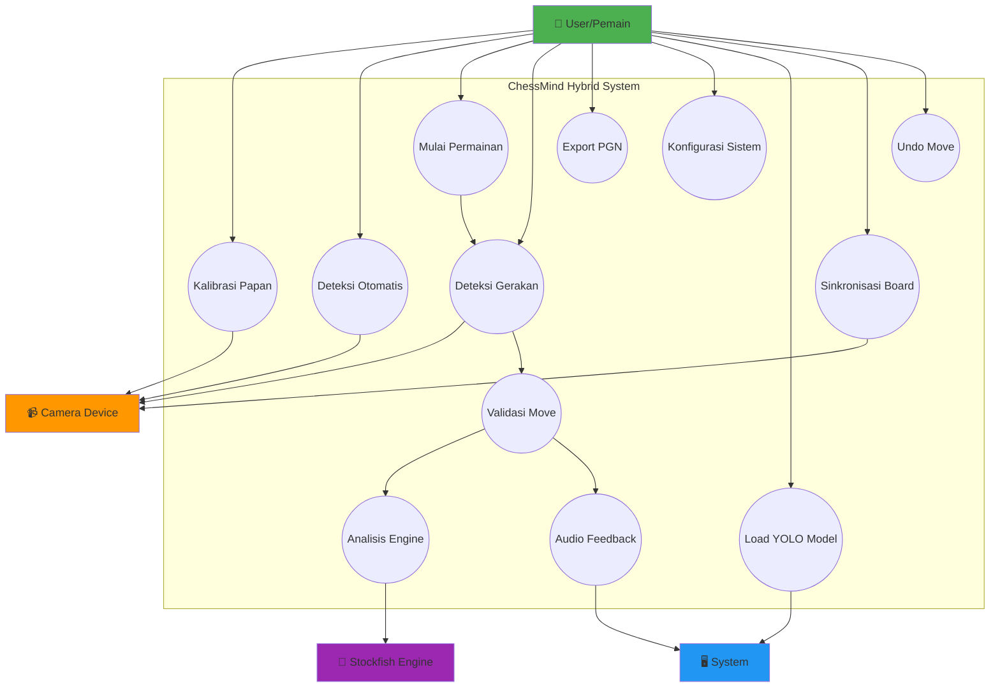
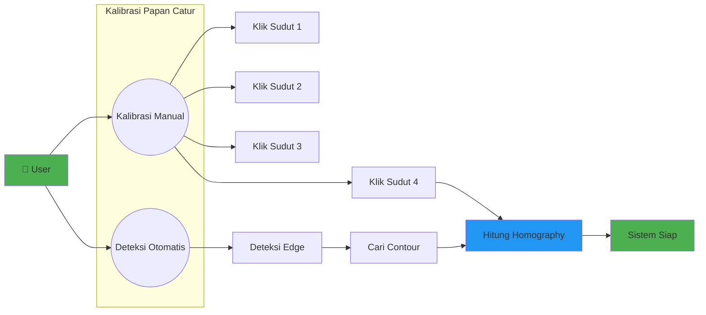
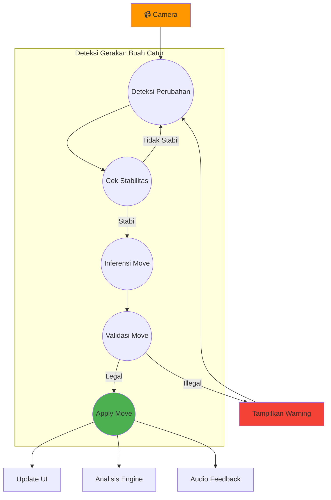
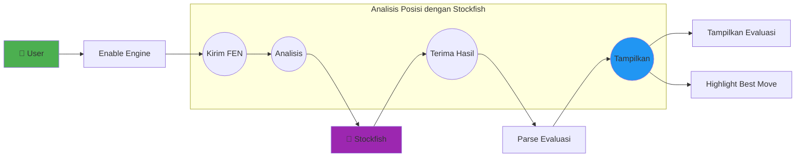
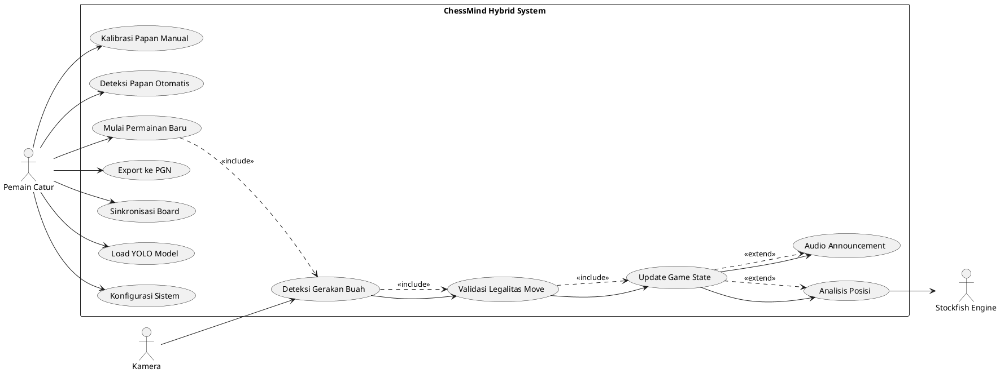

# UML Use Case Diagram
## ChessMind Hybrid Vision System

## 1. Use Case Diagram Utama

## 2. Use Case: Kalibrasi Papan

## 3. Use Case: Deteksi dan Validasi Move

## 4. Use Case: Analisis Engine

## 5. Use Case Diagram - Actor Interactions

## 6. Deskripsi Use Cases

### UC1: Kalibrasi Papan Manual
- **Aktor**: Pemain Catur
- **Precondition**: Kamera aktif, papan catur terlihat
- **Flow**:
  1. User klik tombol "Manual Calibration"
  2. User klik 4 sudut papan catur (TL, TR, BR, BL)
  3. Sistem menghitung homography matrix
  4. Sistem menampilkan warped board
- **Postcondition**: Papan catur terkalibrasi

### UC2: Deteksi Papan Otomatis
- **Aktor**: Pemain Catur, Kamera
- **Precondition**: Kamera aktif
- **Flow**:
  1. User klik tombol "Auto-Detect"
  2. Sistem melakukan edge detection
  3. Sistem mencari contour berbentuk persegi
  4. Sistem menghitung homography matrix
- **Postcondition**: Papan catur terkalibrasi otomatis

### UC3: Mulai Permainan Baru
- **Aktor**: Pemain Catur
- **Precondition**: Papan terkalibrasi
- **Flow**:
  1. User klik "Start New Game"
  2. Sistem reset game state ke posisi awal
  3. Sistem start chess clock
  4. Sistem mulai monitoring perubahan board
- **Postcondition**: Permainan dimulai

### UC4: Deteksi Gerakan Buah
- **Aktor**: Kamera
- **Precondition**: Game sedang berjalan
- **Flow**:
  1. Kamera capture frame
  2. Sistem deteksi dengan Color/YOLO
  3. Sistem build 8x8 grid state
  4. Sistem cek stabilitas (5 frames)
  5. Sistem inferensi move dari perbedaan grid
- **Postcondition**: Move terdeteksi

### UC5: Validasi Legalitas Move
- **Aktor**: System (chess.Board)
- **Precondition**: Move terdeteksi
- **Flow**:
  1. Sistem build UCI move string
  2. Sistem validasi dengan chess.Board.is_legal()
  3. Jika legal, lanjut ke UC6
  4. Jika illegal, tampilkan warning
- **Postcondition**: Move tervalidasi

### UC6: Update Game State
- **Aktor**: System
- **Precondition**: Move valid
- **Flow**:
  1. Sistem apply move ke board
  2. Sistem update FEN
  3. Sistem switch turn
  4. Sistem update clock
  5. Sistem update UI panels
- **Postcondition**: Game state terupdate

### UC7: Analisis Posisi
- **Aktor**: Stockfish Engine
- **Precondition**: Engine enabled, move applied
- **Flow**:
  1. Sistem kirim FEN ke Stockfish
  2. Stockfish analisis posisi (depth 15)
  3. Stockfish return evaluasi dan best move
  4. Sistem tampilkan di Evaluation Panel
- **Postcondition**: Evaluasi ditampilkan

### UC8: Export ke PGN
- **Aktor**: Pemain Catur
- **Precondition**: Game telah dimulai
- **Flow**:
  1. User klik "Export PGN"
  2. Sistem build PGN object dengan headers
  3. Sistem konversi move history ke SAN
  4. Sistem save ke file .pgn
- **Postcondition**: Game tersimpan dalam format PGN

### UC9: Sinkronisasi Board
- **Aktor**: Pemain Catur
- **Precondition**: YOLO model loaded
- **Flow**:
  1. User klik "Sync from Camera"
  2. Sistem ambil current YOLO grid state
  3. Sistem build board dari deteksi YOLO
  4. Sistem set sebagai current position
- **Postcondition**: Board tersinkronisasi dengan kamera

### UC10: Load YOLO Model
- **Aktor**: Pemain Catur
- **Precondition**: Model file tersedia
- **Flow**:
  1. User klik "Load YOLO Model"
  2. User pilih file model (.pt)
  3. Sistem load model dengan Ultralytics
  4. Sistem enable YOLO detection
- **Postcondition**: YOLO detection aktif

### UC11: Konfigurasi Sistem
- **Aktor**: Pemain Catur
- **Precondition**: -
- **Flow**:
  1. User buka Settings Dialog
  2. User edit parameter (camera, YOLO, engine, dll)
  3. User klik Apply
  4. Sistem validate dan save ke config.json
  5. Sistem restart affected components
- **Postcondition**: Konfigurasi terupdate

### UC12: Audio Announcement
- **Aktor**: System (TTS)
- **Precondition**: Audio enabled, move applied
- **Flow**:
  1. Sistem parse move UCI
  2. Sistem build natural language message
  3. Sistem speak dengan TTS (say/espeak/pyttsx3)
- **Postcondition**: Move diumumkan secara audio
