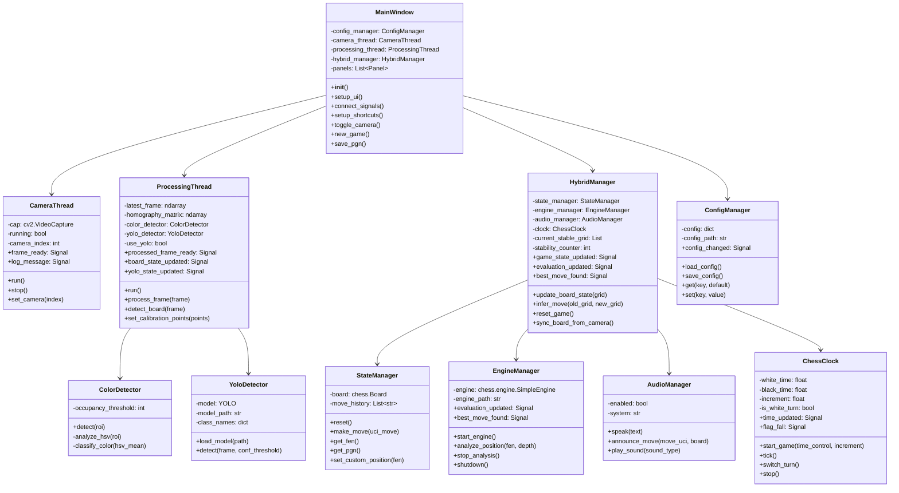
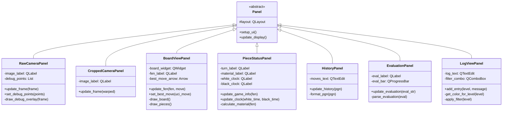
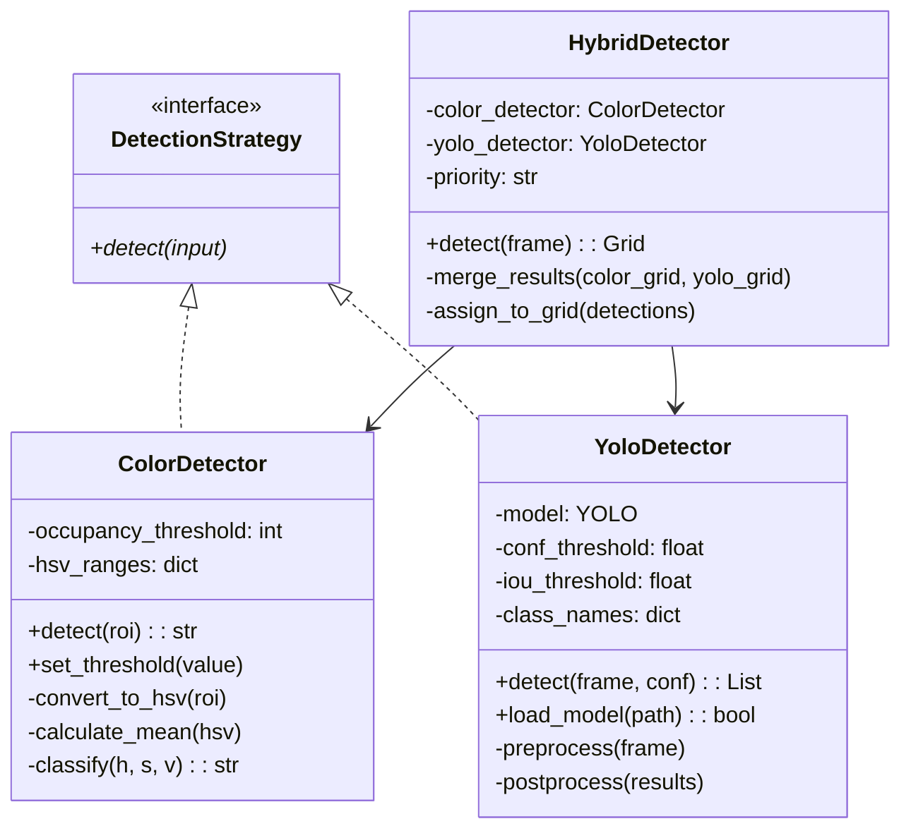
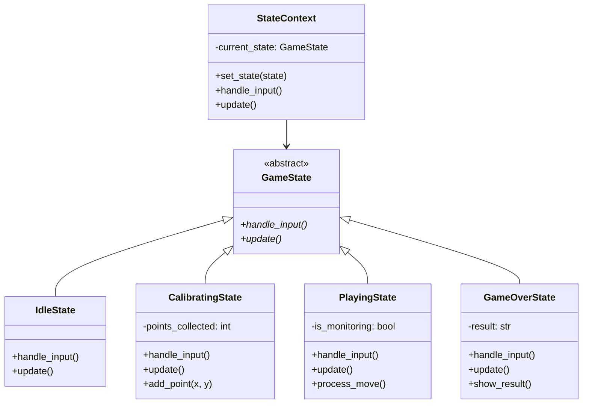
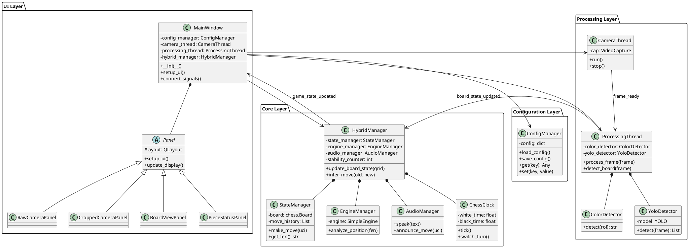

# UML Class Diagram
## ChessMind Hybrid Vision System

## 1. Class Diagram - Core Components

## 2. Class Diagram - UI Panels

## 3. Class Diagram - Detection Strategy Pattern

## 4. Class Diagram - State Pattern

## 5. Class Diagram - Complete Architecture

## 6. Relationship Summary

### Associations
- MainWindow **uses** CameraThread, ProcessingThread, HybridManager
- ProcessingThread **uses** ColorDetector, YoloDetector
- HybridManager **uses** StateManager, EngineManager, AudioManager, ChessClock

### Compositions
- MainWindow **contains** multiple Panels
- HybridManager **owns** StateManager, EngineManager, AudioManager, ChessClock
- ProcessingThread **owns** ColorDetector, YoloDetector

### Dependencies
- All components **depend on** ConfigManager for settings
- UI Panels **depend on** Signals from Core components
- StateManager **depends on** python-chess library

### Inheritance
- All Panel classes **inherit from** base Panel class
- ColorDetector, YoloDetector **implement** DetectionStrategy interface
- GameState classes **inherit from** GameState abstract class
