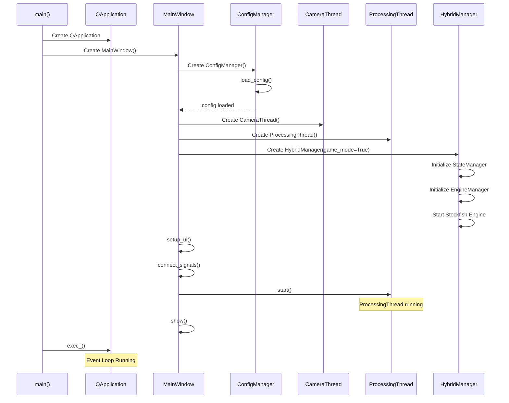
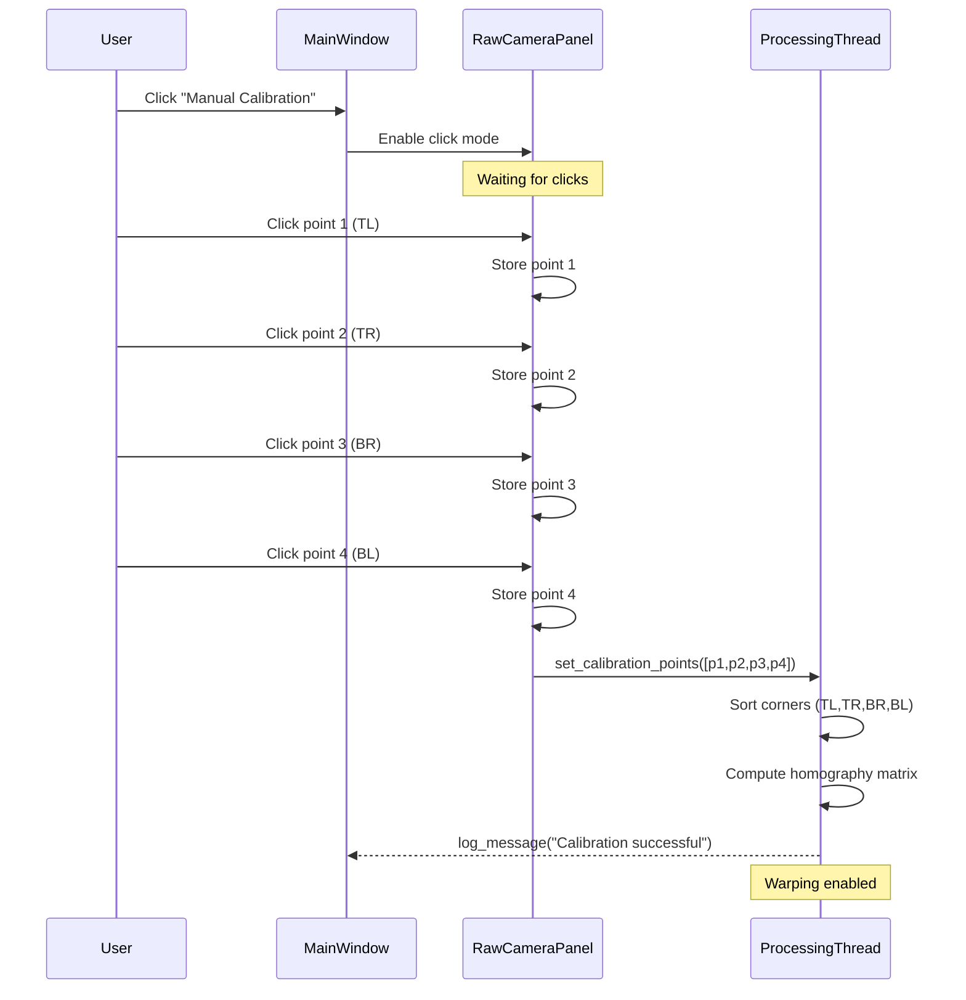
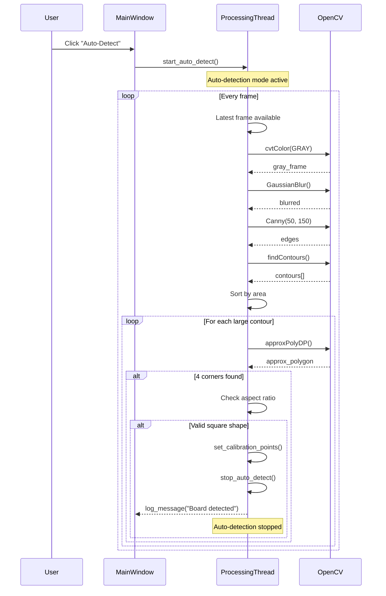
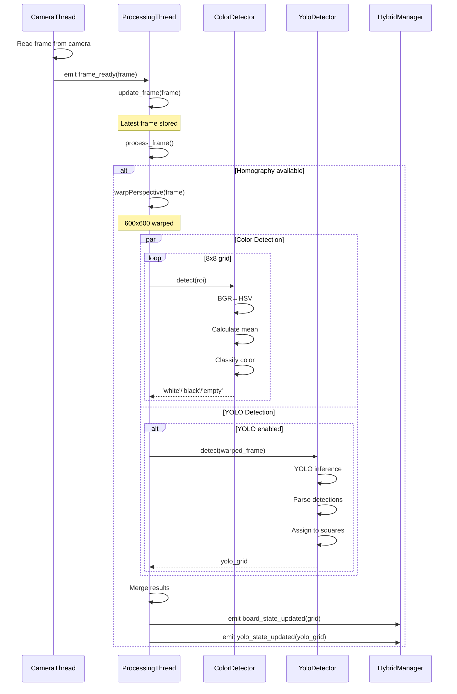
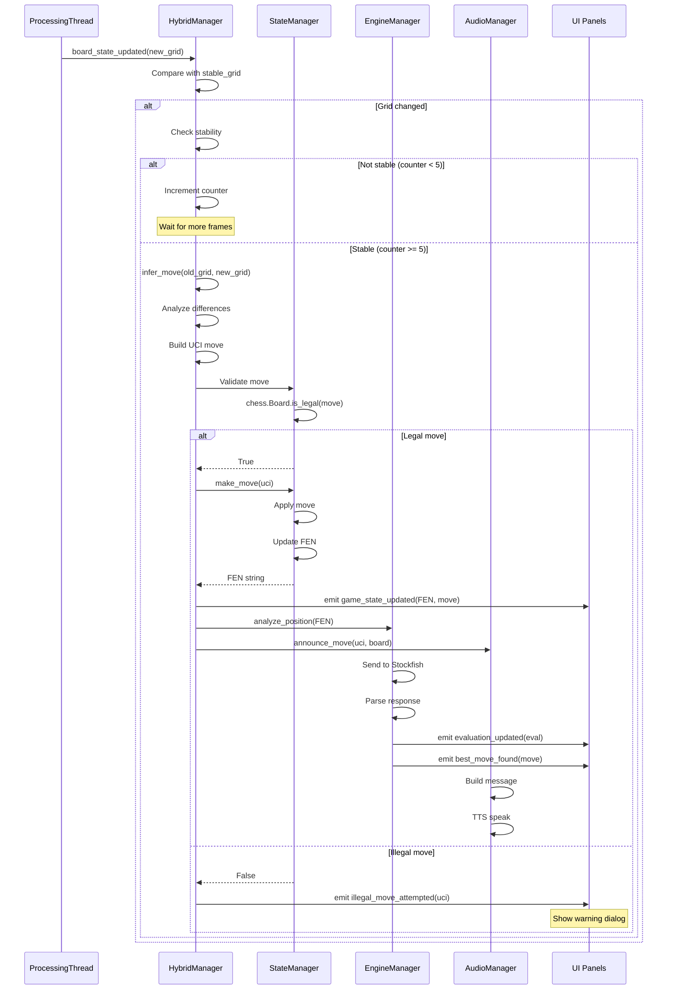
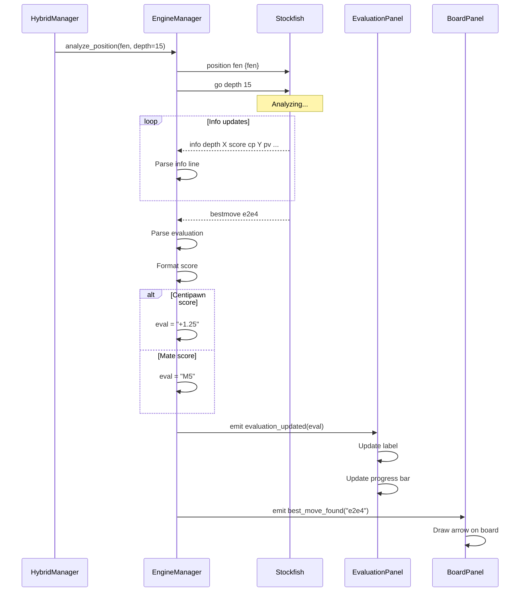
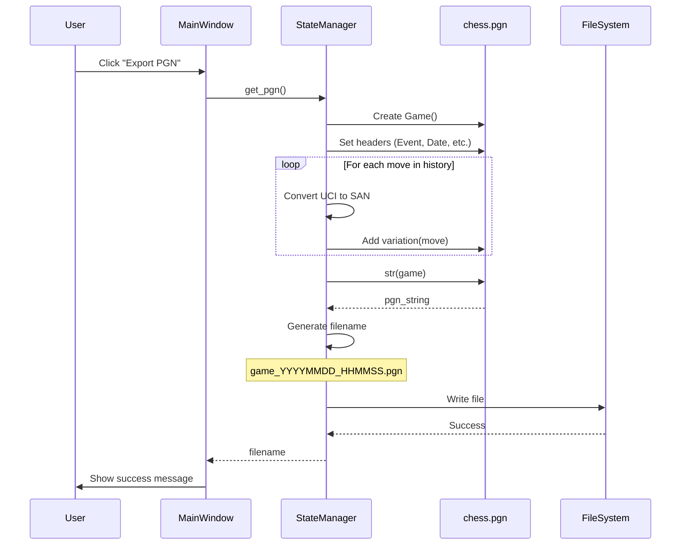
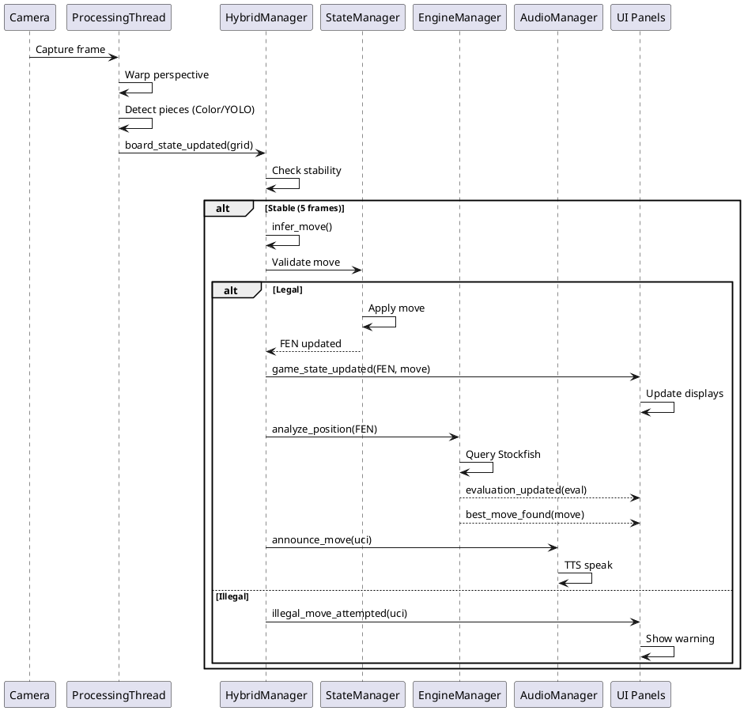
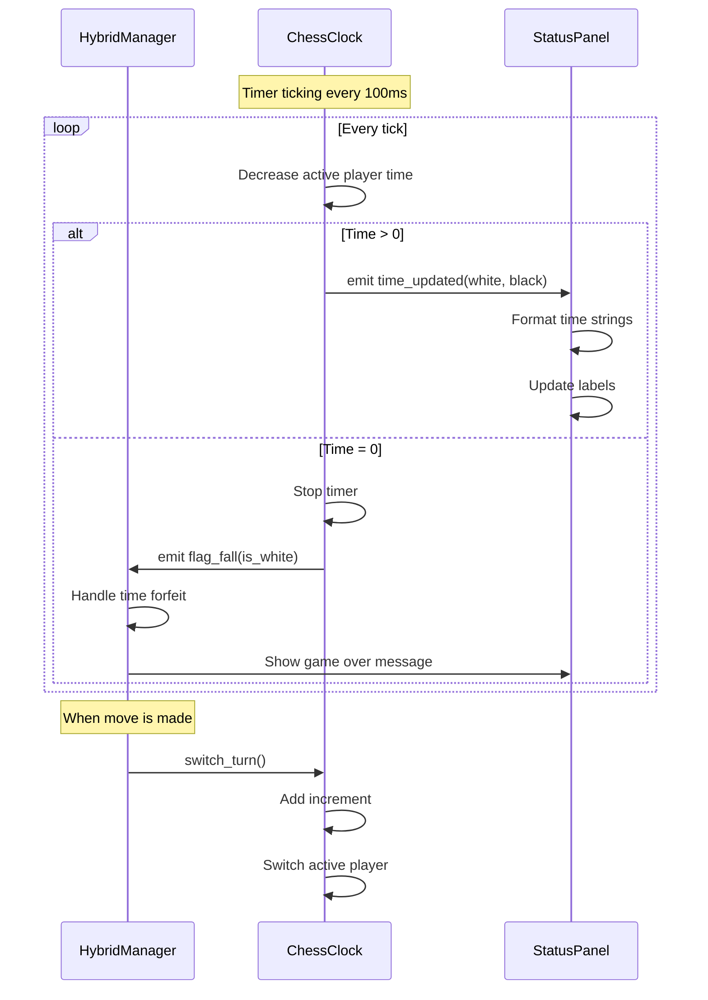

# UML Sequence Diagram
## ChessMind Hybrid Vision System

## 1. Sequence Diagram - Aplikasi Startup

## 2. Sequence Diagram - Kalibrasi Manual

## 3. Sequence Diagram - Auto-Detect Board

## 4. Sequence Diagram - Frame Processing

## 5. Sequence Diagram - Move Detection & Validation

## 6. Sequence Diagram - Engine Analysis

## 7. Sequence Diagram - Export PGN

## 8. Sequence Diagram - Complete Move Flow

## 9. Sequence Diagram - Clock Update

