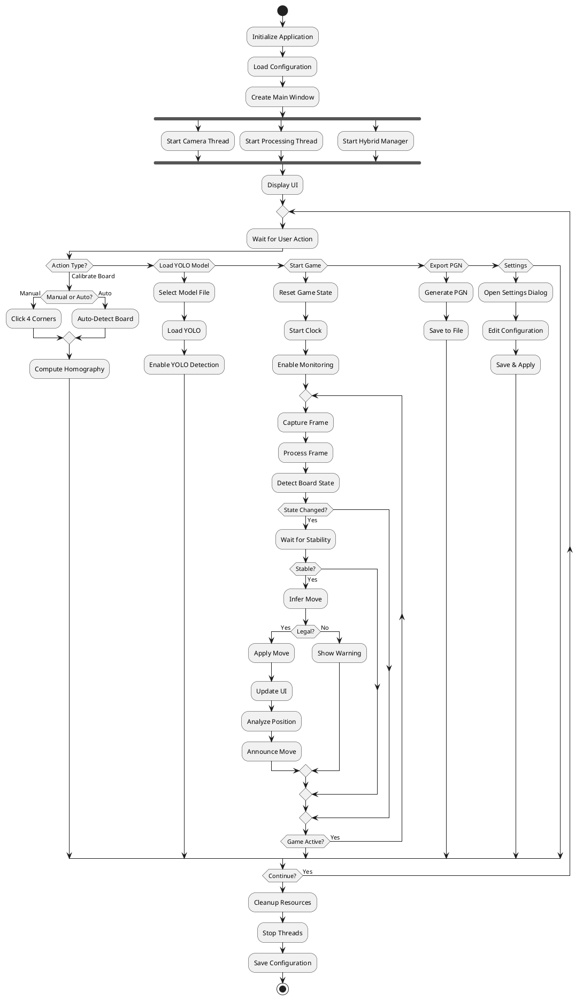
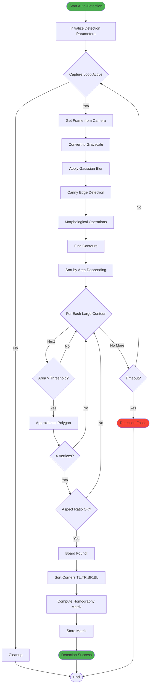
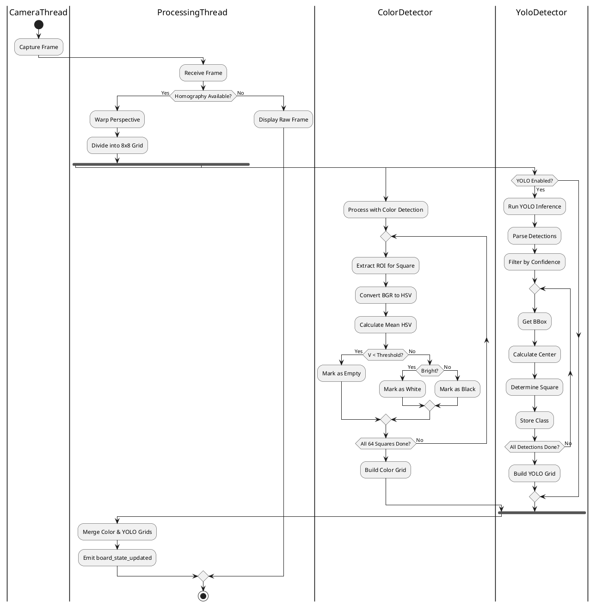
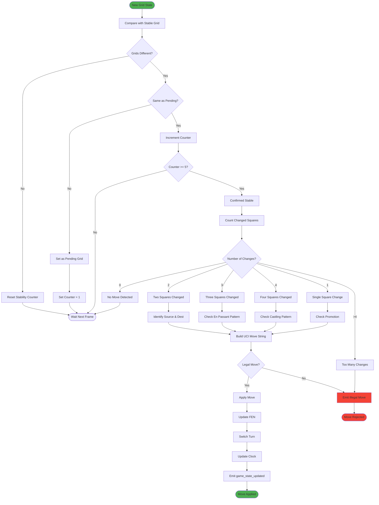
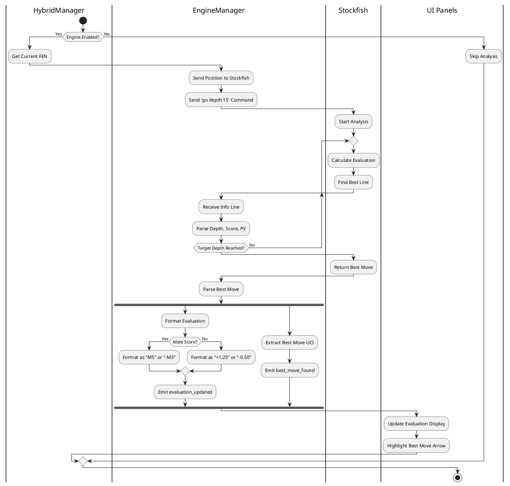
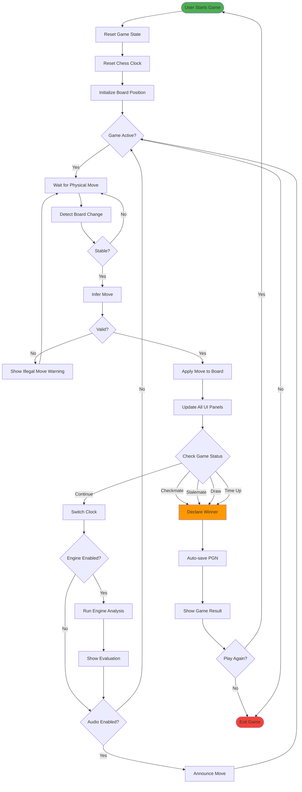
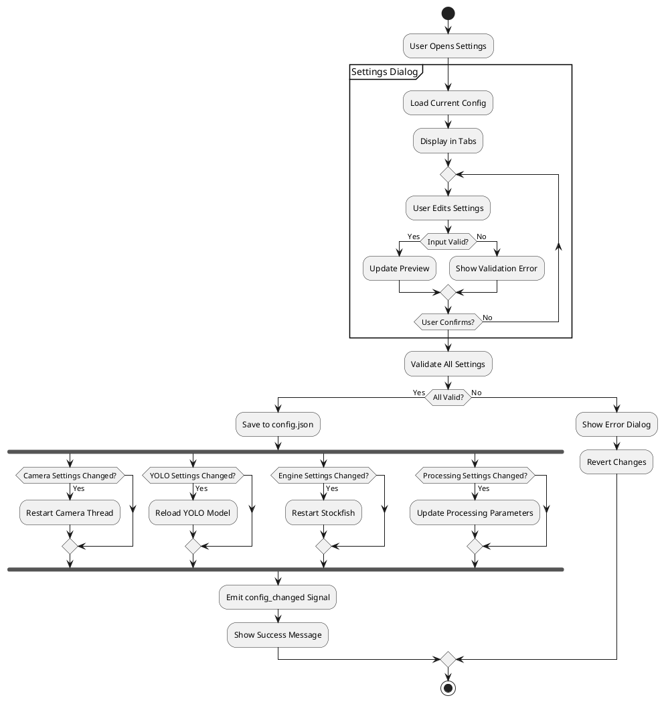
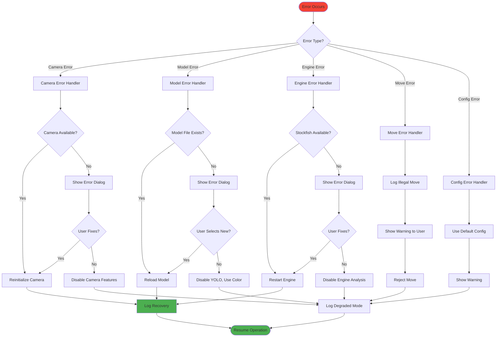

# UML Activity Diagram
## ChessMind Hybrid Vision System

## 1. Activity Diagram - Main Application Flow

## 2. Activity Diagram - Board Detection Process

## 3. Activity Diagram - Frame Processing

## 4. Activity Diagram - Move Inference

## 5. Activity Diagram - Engine Analysis

## 6. Activity Diagram - Game Session

## 7. Activity Diagram - Configuration Management

## 8. Activity Diagram - Error Handling

